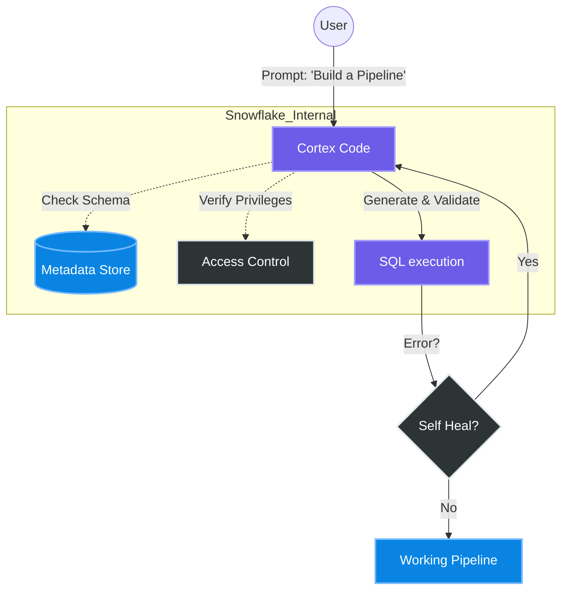

# Snowflake Cortex Code (CoCo)

This note explores **Snowflake Cortex Code (CoCo)**, an AI-powered coding assistant natively integrated into Snowflake. It highlights its strengths in understanding Snowflake metadata, self-healing code, and building data pipelines.

## Key Observations
- **Integration**: "CoCo" has deep knowledge of Snowflake's internals (metadata, limitations like change tracking on sample tables). finding it superior to generic AI for specific Snowflake tasks.
- **Workflow**: It excels at "vibe coding" at a comfortable pace, making it accessible for users overwhelmed by faster/more complex tools like Cursor.
- **Capabilities**:
    - **Self-Healing**: Able to correct mistakes without full refactors.
    - **Pipeline Building**: Successfully built a pipeline using Dynamic Tables.
    - **Refactoring**: Capable of modularizing code upon request.

---

## 👷 Principal Engineer's Deep Dive

### 1. Concept Definition
**Snowflake Cortex Code (Text-to-SQL / Python)** is an LLM-based assistant embedded in Snowflake's UI (Snowsight). Unlike external tools (Copilot, Cursor), it has **Context Awareness** of your specific schema, query history, and role privileges, reducing hallucinations related to non-existent tables or columns.

### 2. Real-time Data Engineering Implementation
*"How do I build a self-healing pipeline using Dynamic Tables?"*

**Scenario**: You want to create a declarative pipeline that updates every minute, but specific constraints exist (e.g., Change Tracking on upstream tables).

**CoCo's Functional Approach**:
Instead of writing complex tasks/streams manually, CoCo suggests **Dynamic Tables**.

```sql
-- 1. Enable Change Tracking (CoCo knows this prerequisite)
ALTER TABLE raw_sales SET CHANGE_TRACKING = TRUE;

-- 2. Define the Dynamic Table (The "Pipeline")
CREATE OR REPLACE DYNAMIC TABLE target_revenue
    TARGET_LAG = '1 minute'
    WAREHOUSE = compute_wh
AS
    SELECT 
        region, 
        SUM(amount) as revenue, 
        DATE_TRUNC('hour', transaction_time) as sale_hour
    FROM raw_sales
    GROUP BY 1, 3;
```

**Why this matters**: If you tried to query a table where `CHANGE_TRACKING` was false, a standard LLM might fail. CoCo checks the metadata first.

### 3. Visualization: The CoCo Context Loop



### 4. Flashcard
*(See Mart)*
