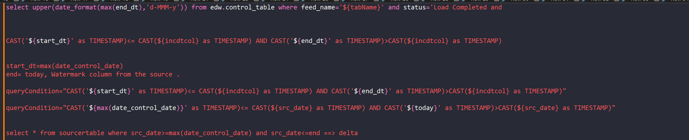
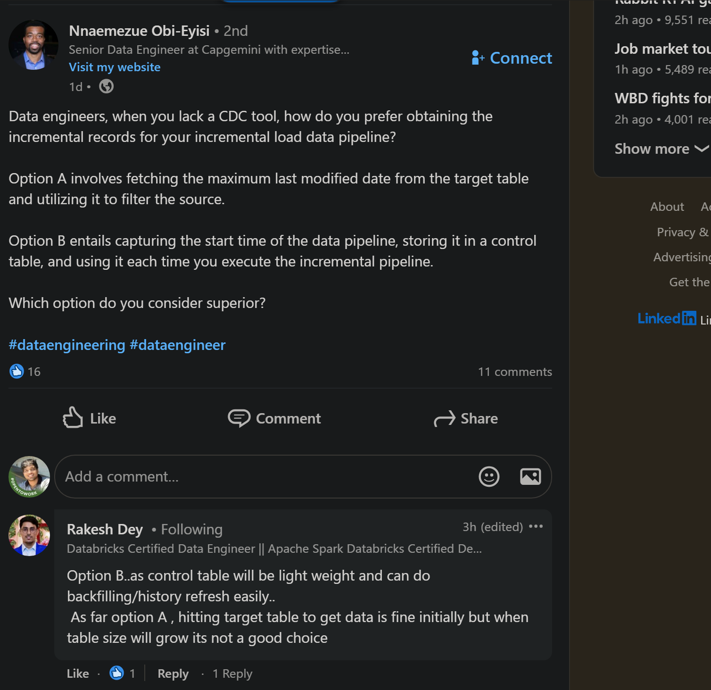

---
tags:
  - concepts
---

# Ingestion Patterns

## 1. Incremental Ingestion
**Definition**: The process of moving only new or modified data from a source to a destination, rather than copying the entire dataset (Full Load). This reduces latency, cost, and compute resources.

### Strategy A: High Watermark (Timestamp/ID Based)
- **Mechanism**: Tracks a specific column (e.g., `updated_at`, `id`) to identify new records.
- **Logic**: `SELECT * FROM source WHERE updated_at > last_high_watermark`
- **Use Case**: Append-only logs, transaction tables.
- **Pros**: Simple to implement using standard SQL.
- **Cons**: Cannot track "Hard Deletes" (rows removed from source); requires an index on the watermark column.
- **Visual Reference**:
	- 

### Strategy B: Change Data Capture (CDC)
- **Mechanism**: Reads the database transaction logs (Binary Logs, Write-Ahead Logs) to capture changes.
- **Logic**: Captures every `INSERT`, `UPDATE`, and `DELETE` event as a stream.
- **Use Case**: Databases requiring exact synchronization (including deletes).
- **Pros**: Handles hard deletes, low impact on source DB (reads logs, not tables), real-time.
- **Cons**: Complexity in setup (requires tools like Debezium, AWS DMS).
- **Visual Reference**:
	- 

### Related
- [[data_merging_strategies]]
- [[change_data_capture]]

