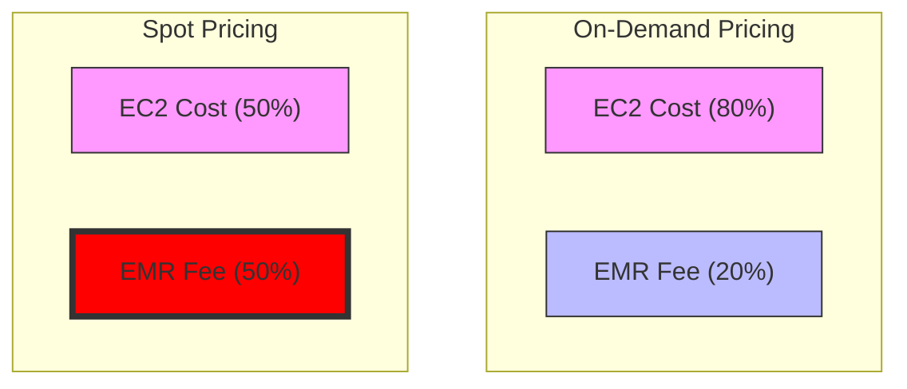

---
tags:
  - compute
---

# EMR Pricing & Optimization Strategy

## The Hidden Cost of Managed Spark

A common misconception in cloud data engineering is that Amazon EMR's cost is negligible compared to the underlying EC2 compute. While this holds true for On-Demand instances, the economics shift drastically when optimizing with Spot instances.

### The Pricing Model Breakdown

EMR charges a per-instance-hour management fee on top of the EC2 price. This fee is fixed regardless of whether you pay full price for EC2 (On-Demand) or a discounted rate (Spot).

**The Math:**
*   **On-Demand**: EMR fee is ~20-25% of the total cost.
*   **Reserved Instances**: EMR fee rises to ~33% of the total.
*   **Spot Instances**: EMR fee can exceed **50%** of the total.

### Impact of Spot Instances

Spot instances offer up to 90% savings on EC2. However, because the EMR fee remains constant, the *relative* overhead of the management layer skyrockets.

> **Key Takeaway**: As you optimize compute costs (the denominator), the fixed management fee (the numerator) becomes a significantly larger tax.

## Strategic Implications: EMR vs. K8s

This pricing dynamic drives many mature data organizations to migrate from EMR to self-managed Spark on Kubernetes (EKS).

| Feature | EMR (Managed) | Spark on K8s (Self-Managed) |
| :--- | :--- | :--- |
| **Setup** | Turnkey, easy to start | High complexity, requires DevOps |
| **Cost** | EC2 + EMR Fee | EC2 only (No EMR tax) |
| **Scaling** | Managed Auto-scaling | Karpenter / HPA (User-defined) |
| **Spot Handling** | Native support | Requires robust handling |

**Decision Framework:**
1.  **Small Scale**: Stay on EMR. The engineering time to manage K8s > EMR fees.
2.  **Large Scale**: Move to Spark on K8s. The "EMR Tax" at scale justifies the engineering investment.

## Optimization Techniques

 If remaining on EMR, you must instrument cost monitoring to capture the *true* cost per job.

1.  **Tagging**: Aggressively tag clusters by team/project.
2.  **Spot Fleets**: Use mixed instance fleets to minimize Spot interruptions.
3.  **Graviton**: Move to ARM-based instances (r7g, r8g) for better price/performance (often 20% cheaper).

### Reference
*   **Source**: Analysis of EMR pricing models and community discussions on cost optimization.
