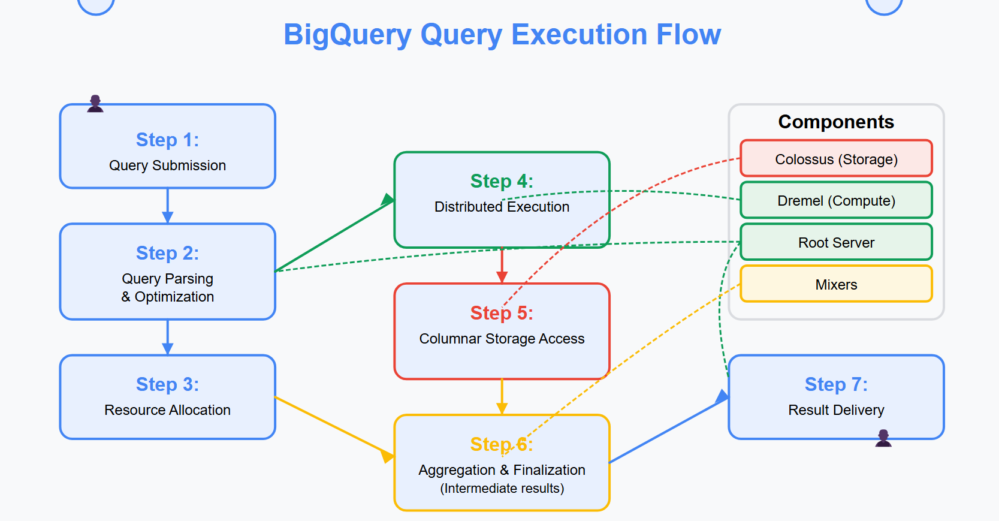

---
tags:
  - warehousing
---

# BigQuery Architecture
	- ## Key Architecture Concept
		- Decoupling store and compute so we pay individually
		- In RDBMS we pay store + compute together
	- ## Storage and Compute
		- Storage :: <-> {{Colossus}} ^68086cc4-2686-4904-b0bd-e457ca8be203
			- Google's distributed file system for data storage
			- Columnar storage format for optimized query performance
			- Automatic management and optimization of storage
		- Compute :-> {{Dremel}} ^68086cc4-9437-4f60-ba93-4edd94ca68c3
			- Dremel : -> {{Root server (Coordinates query execution) ; Mixers (Aggregate data) ; Leaf nodes (Read data from storage) }}
		- ^^MN^^ : Jupiter (gladiator) performs in Colossus with weapon called Dremel
		- ^^NM^^ : Dremel is like camel
	- ## Connecting Components
		- High-speed network protocol connecting Dremel (compute) and Colossus (storage) :-> {{Jupiter }} ^68086cc4-97c9-489d-9a7e-c71b920fbfe7
		- Orchestrator managing internal communication between components :-> {{Borg}} ^68086cc4-893f-4b23-ac8b-f998a83bba25
	- ## Query Execution Flow
		- 
- # BigQuery Tables
 collapsed:: true
	- ## Empty Tables
	 collapsed:: true
		- Tables created with defined schema but containing no data
		- Serve as structure for future data insertion or loading
	- ## Creating Tables
		- Can create from:
			- Empty table
			- Google Cloud Storage
			- Upload
			- Drive
			- Google BigTable
			- Amazon S3
			- Azure Blob storage
	- ## Partitioning Types
	 1. Integer Range
	 2. Time-unit Column (e.g., 1960-01-01, 2159-12-12)
	 3. Ingestion time
		- Note: You can't create a string as partition column in BigQuery
- # BigQuery Concepts
	- DB called as :-> {{Dataset}} ^68086cc4-4594-41fc-9b51-bdfbc5c4af78

### Related
- [[Analytical_Eng]]
- [[Cloud_engineering]]
