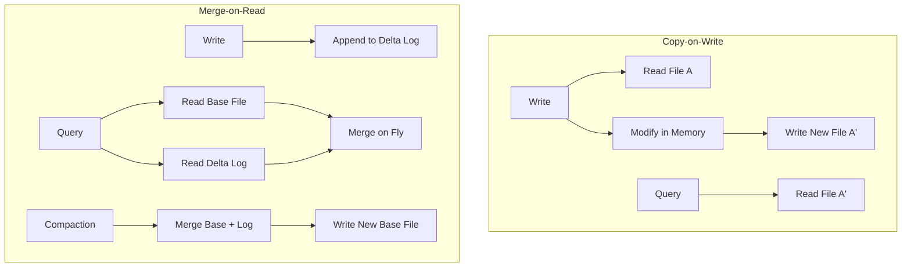

---
tags:
  - warehousing
---

# Data Lake Table Formats

## Concept

Data Lake Table Formats (Delta Lake, Apache Iceberg, Apache Hudi) are middleware layers that sit on top of distributed file systems (like S3, ADLS, HDFS) to provide ACID transactions, scalable metadata handling, and schema evolution. They turn a "Data Swamp" into a "Data Lakehouse," enabling data warehouse-like reliability and performance on low-cost object storage.

---

## Comparison: Delta Lake vs Apache Iceberg vs Apache Hudi

| Feature | Delta Lake | Apache Iceberg | Apache Hudi |
| :--- | :--- | :--- | :--- |
| **Storage** | Parquet + `_delta_log` (JSON) | Parquet/ORC/Avro + Snapshot JSON | Parquet/Avro + `.hoodie` Timeline |
| **Transactions** | Optimistic Concurrency Control (OCC) | Multi-Version Concurrency Control (MVCC) | MVCC with Timeline |
| **Schema Evolution** | Auto Merge (Additive) | Full Evolution (Add, Drop, Rename, Reorder) | Backward Compatible |
| **Partitioning** | Explicit (Physical folders) | **Hidden Partitioning** (Transforms) | Explicit (Physical folders) |
| **Best For** | Spark-centric, Databricks Ecosystem | Large scale, Multi-engine (Trino, Flink) | Streaming, CDC, Mutable Data |

---

## Apache Hudi Deep Dive

Apache Hudi (Hadoop Ubiquitous Data Insights) is optimized for managing large analytical datasets on HDFS or cloud storage and provides primitives for stream processing on data lakes.

### Table Types

1.  **Copy-on-Write (COW)**:
    *   **Mechanism**: Data stored in columnar Parquet files. When an update occurs, Hudi rewrites the *entire* file containing the record.
    *   **Pros**: Fast reads (optimized columnar format). No compaction needed.
    *   **Cons**: High write latency (write amplification).
    *   **Use Case**: Read-heavy workloads, batch processing.

2.  **Merge-on-Read (MOR)**:
    *   **Mechanism**: Hybrid approach. Base files (Parquet) + Delta Logs (Avro). Updates are appended to delta logs.
    *   **Read**: Real-time queries merge base files + delta logs on the fly.
    *   **Compaction**: Background process merges delta logs into new base files.
    *   **Pros**: Low write latency (append-only).
    *   **Cons**: Slower reads (merge overhead), complexity of compaction tuning.
    *   **Use Case**: Streaming, CDC, write-heavy workloads.

### Indexing Strategies

Indexes map record keys to file paths, critical for upsert performance.

*   **Bloom Index** (Default): Uses bloom filters in file footers to prune files that *might* contain a key. Good for random updates.
*   **Simple Index**: Joins incoming records against storage to find existing keys. Lean but slow for large tables.
*   **HBase Index**: External index for ms-latency lookups (requires HBase cluster).
*   **Bucket Index**: Deterministic hashing (like Hive bucketing). Fast for large tables, handles skew, constant lookup time.

### Write Operations

*   **UPSERT**: Update if exists, else Insert. Default operation.
*   **INSERT**: Append new records. Faster than upsert (skips index lookup).
*   **BULK_INSERT**: Efficient for initial loads. Supports sorting (Global, Partition) to optimize file sizing.
*   **DELETE**: Soft deletes (nulls) or Hard deletes.

### Query Types

*   **Snapshot Query**: Latest view of the table (merges base + delta for MOR). Near-real-time.
*   **Incremental Query**: Pulls only data changed since commit `t`. Enables efficient incremental pipelines.
*   **Read Optimized Query**: Sees only base files (no delta logs). Fast but potentially stale (ignores uncompacted data).

---

## Code Example: Hudi Upsert with PySpark

```python
from pyspark.sql import SparkSession

spark = SparkSession.builder 
    .appName("HudiUpsertExample") 
    .config("spark.serializer", "org.apache.spark.serializer.KryoSerializer") 
    .getOrCreate()

# Hudi Configuration
hudi_options = {
    'hoodie.table.name': 'hudi_table_cow',
    'hoodie.datasource.write.recordkey.field': 'id',
    'hoodie.datasource.write.partitionpath.field': 'creation_date',
    'hoodie.datasource.write.table.name': 'hudi_table_cow',
    'hoodie.datasource.write.operation': 'upsert',
    'hoodie.datasource.write.precombine.field': 'last_update_time',
    'hoodie.upsert.shuffle.parallelism': 2,
    'hoodie.insert.shuffle.parallelism': 2
}

# Dummy Data
data = [
    (1, "record1", "2023-10-01", "2023-10-01 10:00:00"),
    (2, "record2", "2023-10-01", "2023-10-01 10:05:00")
]
columns = ["id", "name", "creation_date", "last_update_time"]

input_df = spark.createDataFrame(data, columns)

# Write Dataframe to Hudi
basePath = "/tmp/hudi_table_cow"
input_df.write.format("hudi") 
    .options(**hudi_options) 
    .mode("append") 
    .save(basePath)
```

---

## Diagram: Hudi Write Paths


