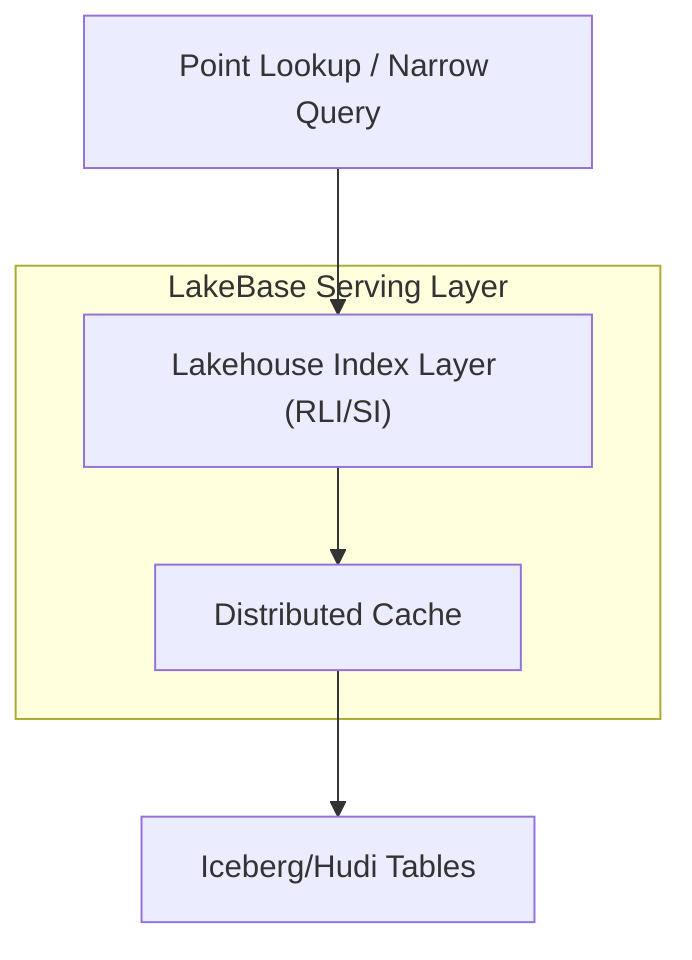

# Database Indexing Strategy

Indexing is a trade-off, not a free performance boost. While indexes speed up reads, they introduce "write amplification" because every `INSERT` or `UPDATE` must also update the index structures.

## The Hidden Cost of Indexes
- **Write Latency**: Every `INSERT` updates `N+1` data structures (Heap + N Indexes).
- **Storage Bloat**: Indexes consume significant disk and memory.
- **Planner Confusion**: Too many indexes can confuse the query optimizer.

> **Rule of Thumb**: Verify if an index justifies its write cost.

## Optimization Framework
The goal is to have the minimum number of indexes that cover the maximum number of query patterns.

1.  **Audit Regularly**: Use `pg_stat_user_indexes` (in Postgres) to find unused indexes.
2.  **Delete Unused Indexes**: If an index has zero scans in 30 days, it is dead weight.
3.  **Prefer Composite Indexes**: A single composite index on `(A, B)` can often replace separate indexes on `A` and `B` (depending on query patterns).
4.  **Use Covering Indexes**: Indexes that include all columns required by a query (via `INCLUDE` clause or composite keys) allow **Index Only Scans**, bypassing the heap entirely.
5.  **Partial Indexes**: Index only a subset of rows (e.g., `WHERE status = 'active'`) to save space and improve performance for specific queries.

## Example Scenario
**Problem**: A table with 34 indexes had fast reads but P99 insert latency of 1.2s.
**Solution**:
- Analyzed usage via `pg_stat_user_indexes`.
- Removed 28 unused/redundant indexes.
- Created 3 composite indexes covering 94% of queries.
**Result**:
- Write latency dropped 73%.
- Storage reduced by 40%.
- Read performance remained identical.

## Code Example (Postgres)
```sql

## Lakehouse Indexing (LakeBase)
Lakehouse engines are traditionally optimized for full scans, making point lookups expensive. Solutions like Onehouse LakeBase introduce first-class indexing primitives for **Apache Iceberg** and **Apache Hudi**.



- **Global Record-Level Indexing (RLI)**: Speeds up specific record lookups.
- **Secondary Indexing (SI)**: Allows fast filtering on non-primary keys.
- **Index Joins**: Changes join complexity from O(N + M) (scan-based) to O(K) where K is the number of qualifying rows. This is critical for AI agent exploration patterns.
- **Performance**: TPC-DS benchmarks show up to a 95% reduction in query latency for narrow queries.

### Index Join Comparison
| Feature | Standard Lakehouse Join (Spark/Trino) | LakeBase Index Join |
| :--- | :--- | :--- |
| **Strategy** | Broadcast, Shuffle Hash, Sort-Merge | Global RLI / SI Lookups |
| **Complexity** | O(N + M) (Data scanned/shuffled) | O(K) (Filtered working set) |
| **Use Case** | Batch/Large Scans | Selective/Agent Drill-down |

