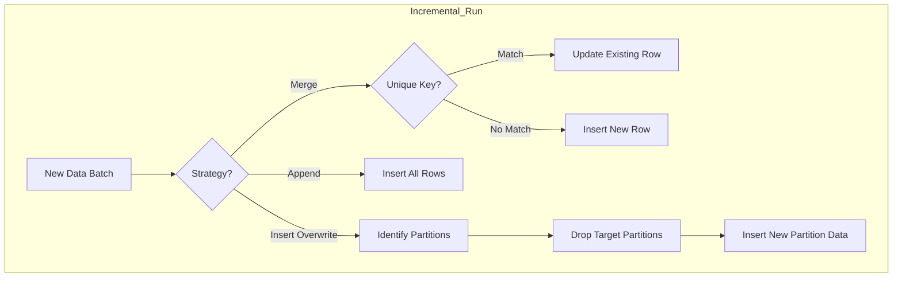

# dbt Incremental Strategies & Schema Evolution

In dbt (data build tool), managing large datasets efficiently requires moving beyond full refreshes. This is where **incremental models** come in.

Core Mental Model:
*   **Strategy** (`incremental_strategy`) handles the **ROWS** (How do I add/update data?).
*   **On Schema Change** (`on_schema_change`) handles the **COLUMNS** (What if the source table shape changes?).

## 1. Incremental Strategies (Row Management)

The `incremental_strategy` config determines how dbt updates your destination table with new data from your source.

| Strategy | Mechanism | Best For | Trade-offs |
| :--- | :--- | :--- | :--- |
| **`merge`** (Default) | Matches records on `unique_key`. Updates existing, inserts new. | Dimensions (SCD Type 1), Mutable data. | High compute cost (scan + update). Requires `unique_key`. |
| **`append`** | Insert only. No checks for duplicates. | Immutable Event Logs, Clickstreams. | Fastest write speed. No deduplication. |
| **`delete+insert`** | Deletes rows matching the new batch's keys, then inserts new batch. | Databases where `MERGE` is slow/unavailable (e.g., Redshift, Spark). | Two-step process, slightly higher atomicity risk. |
| **`insert_overwrite`** | Replaces entire partitions (e.g., by Date). | Large Fact tables, Daily Aggregates. | **Idempotent**. Requires partitioning. Fastest for massive updates. |

## 2. On Schema Change (Column Management)

This config controls dbt's behavior when the columns in your transformation (`.sql`) differ from the columns in the existing destination table.

*   **`ignore`** (Default): Do nothing. New source columns are ignored. Table schema remains static.
*   **`fail`**: Raise an error. Pipeline stops. (Best for strict data contracts).
*   **`append_new_columns`**: Add new columns to the destination table. (Safe evolution).
*   **`sync_all_columns`**: Add new columns **AND drop** missing ones. (Risky but clean).

## 3. Real-World Patterns

### Pattern A: The "Living" Dimension
*   **Goal**: Maintain a user table where attributes (e.g., `loyalty_tier`) change, and we occasionally add new profile fields.
*   **Config**: `strategy='merge'`, `on_schema_change='append_new_columns'`
*   **Why**: `merge` keeps rows fresh. `append_new_columns` prevents failures when a new field like `is_vip` is added upstream.

### Pattern B: The Partitioned Fact Table
*   **Goal**: Reprocess daily revenue summaries reliably.
*   **Config**: `strategy='insert_overwrite'`, `on_schema_change='sync_all_columns'`
*   **Why**: If logic changes for "revenue", we want to wipe the whole day and restate it. `sync_all_columns` ensures deleted metrics don't linger as NULLs.

## 4. Code Examples

### Scenario 1: Merge Strategy (User Dimension)

```sql
{{
  config(
    materialized='incremental',
    unique_key='user_id',
    incremental_strategy='merge',
    on_schema_change='append_new_columns'
  )
}}

SELECT
    user_id,
    email,
    last_login,
    current_status -- improved column
FROM {{ source('raw', 'users') }}


  -- Only process records changed since the last run
  WHERE updated_at > (SELECT max(updated_at) FROM {{ this }})

```

### Scenario 2: Insert Overwrite (Daily Facts)

```sql
{{
  config(
    materialized='incremental',
    partition_by={'field': 'date_day', 'data_type': 'date'},
    incremental_strategy='insert_overwrite',
    on_schema_change='fail' -- Stick to the contract!
  )
}}

SELECT
    date_day,
    store_id,
    sum(amount) as daily_revenue
FROM {{ ref('stg_orders') }}


  -- Replace data for days in the current batch
  WHERE date_day in (select distinct date_day from {{ ref('stg_orders') }})

```

## 5. Visualizing the Logic


