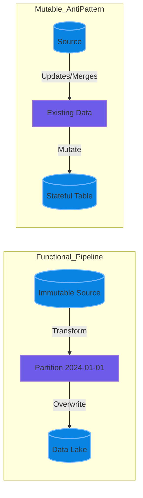

# Functional Data Engineering

This note covers the principles of Functional Data Engineering and the risks of mutable partitions in modern table formats like Iceberg and Delta.

## The Problem with Mutable Partitions

Partitions no longer being immutable in formats like Iceberg and Delta is a good thing. But this new power invites a lot of bad practices:

- Duplicates creeping in from sloppy upserts
- Non-deterministic reprocessing that silently rewrites history
- "Fix it in place" mentalities instead of fixing upstream contracts
- Broken idempotency assumptions across pipelines
- Hidden backfills that invalidate downstream aggregates
- Debugging nightmares when yesterday's data isn't actually yesterday's data
- Teams treating tables like mutable OLTP systems instead of analytical logs

## Why Functional DE Still Matters

Pipelines should behave like pure functions:
- **Same inputs → same outputs**
- **Explicit side effects**
- **Time and state modeled, not implied**

> Mutable partitions don't remove the need for discipline. They raise the bar for it.
> Iceberg and Delta give you scalpels. Functional thinking is what keeps you from using them like chainsaws.

---

## 👷 Principal Engineer's Deep Dive

### 1. Concept Definition
**Functional Data Engineering** treats data pipelines as pure functions (f(data) = output) that are reproducible and side-effect free.

**Mutable Partitions** (in Iceberg/Delta) allow `UPDATE`/`DELETE` on immutable files by rewriting them. While powerful (GDPR, corrections), abusing them violates functional principles, leading to "stateful" tables where history is lost.

### 2. Real-time Data Engineering Implementation
*"How do we handle backfills safely?"*

Instead of:
```sql
-- ❌ Mutable/Risky
UPDATE target SET col = val WHERE date = '2024-01-01'
```

Use **Overwrite Partition**:
```sql
-- ✅ Functional Approach: Replace the entire partition atomically
INSERT OVERWRITE target_table
PARTITION (date='2024-01-01')
SELECT * FROM source_transformed
WHERE date = '2024-01-01'
```

This ensures **idempotency**. If you run it twice, the result is identical.

### 3. Visualization


### 4. Key Trade-offs

| Approach | Pros | Cons |
|----------|------|------|
| **INSERT OVERWRITE** | Idempotent, reproducible, auditable | Requires full partition rewrite |
| **MERGE/UPDATE** | Efficient for small changes | Breaks reproducibility, complex debugging |
