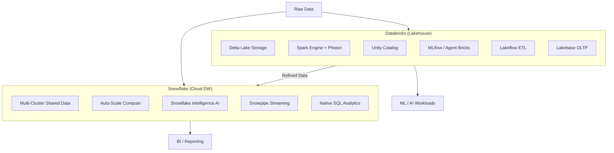
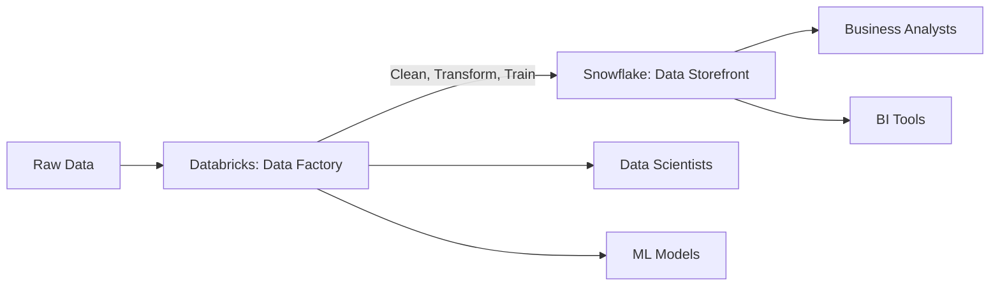

# Snowflake vs Databricks (2026)

## Overview Diagram

## Core Philosophy Difference

| Aspect | Databricks | Snowflake |
| :--- | :--- | :--- |
| **Best For** | Data engineering, large-scale processing, ML | SQL analytics, BI, ease of use |
| **Operating Model** | Code-first, engineering-centric | SQL-first, analyst-centric |
| **Scaling** | Manual tuning for performance | Hands-off auto-scaling |

## Architecture & Data Foundation

**Databricks** operates as a lakehouse platform built on Delta Lake, an open-source storage format. Databricks leverages Spark-based parallel processing for superior speed and scalability and includes the Photon Engine, a C++-based query engine that enhances SQL performance significantly. A significant 2025 development: Databricks introduced Lakebase, a Postgres-compatible OLTP engine embedded in the lakehouse.

**Snowflake** follows a multi-cluster shared data architecture with separation between storage and compute. Snowflake is optimized for fast and concurrent SQL queries and includes features like auto-scaling and auto-suspending.

## Data Engineering Capabilities

- **Databricks**: Lakeflow (no-code ETL), vector search for RAG, Unity Catalog for governance
- **Snowflake**: Snowpipe for streaming, native SQL transformations, governed reporting

## Cost Dynamics

- **Databricks**: More cost-efficient for heavy data processing and ML workloads
- **Snowflake**: More predictable costs for SQL analytics and BI usage

## AI/ML Integration

- **Databricks**: Agent Bricks, MLflow 3.0 with GenAI observability, vector search for RAG
- **Snowflake**: Snowflake Intelligence (plain English queries), Data Science Agent

## Hybrid Strategy (Common Pattern)

## Decision Guide

| Use Case | Recommendation |
| :--- | :--- |
| Complex transformations, real-time streaming | **Databricks** |
| Unstructured data, custom ML pipelines | **Databricks** |
| Structured analytics, BI, reporting | **Snowflake** |
| High concurrency SQL queries | **Snowflake** |
| Both? | Hybrid: Databricks as factory, Snowflake as storefront |
