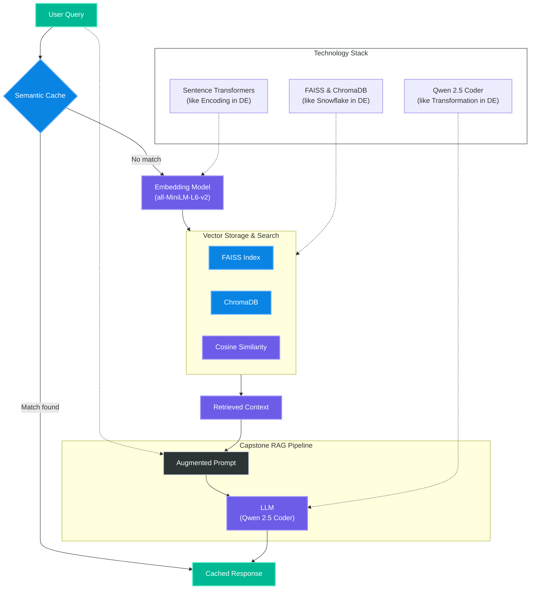

---
tags:
  - "#ai"
created_at: "2026-02-11 19:55"
source: "AI Engineering - Week 3"
status: growing
---
# Embeddings & Retrieval

This note covers the foundations of modern AI applications: how text is represented as vectors (embeddings) and how those vectors are used for semantic search, caching, and Retrieval-Augmented Generation (RAG).

---

## System Architecture

---

## Architecture Breakdown

### 1. Semantic Caching (The Fast Path)

Before performing a full search, we check if a similar question has been asked recently.

- **Semantic Cache**: Uses vector similarity to reuse previous answers even if the query isn't an exact match.
- **DE Equivalent**: Like a **Materialized View** or a **TTL-based Cache** (Redis) that stores pre-calculated results for expensive join queries.

### 2. Vectorization & Embedding

We transform raw text into numerical representation.

- **Embedding Model**: Encodes semantic meaning into a high-dimensional vector.
- **DE Equivalent**: Like **Data Encoding** or **Hashing** specifically designed for similarity rather than exact matching.

### 3. Vector Search (The Retrieval)

We search our databases for the most relevant pieces of information.

- **FAISS/ChromaDB**: Efficient high-dimensional indexing for similarity search.
- **DE Equivalent**: Like a **Database Index** optimized for `JOIN` operations across massive tables, but using distance metrics instead of primary keys.

### 4. RAG Pipeline (The Generation)

We combine user intent with retrieved data to produce a grounded answer.

- **Augmented Prompt**: Merges the User Query + Retrieved Documents.
- **DE Equivalent**: Like a **Data Enrichment (Lookup)** step in an ETL pipeline where a source record is joined with master data before final loading.

---

## Key Components

### 1. Vector Foundations

- **Cosine Similarity**: Measuring the semantic distance between two blocks of text.
- **Embeddings**: Transforming text into high-dimensional numerical arrays.
- **Vector Core**: Core logic for vector representation.

### 2. Vector Databases

- **FAISS**: High-performance similarity search using Facebook AI Similarity Search.
- **ChromaDB**: Implementing local vector storage using ChromaDB.

### 3. Semantic Caching

- **Semantic Cache**: Intercepts queries to reduce costs and latency by reusing similar previous answers.
