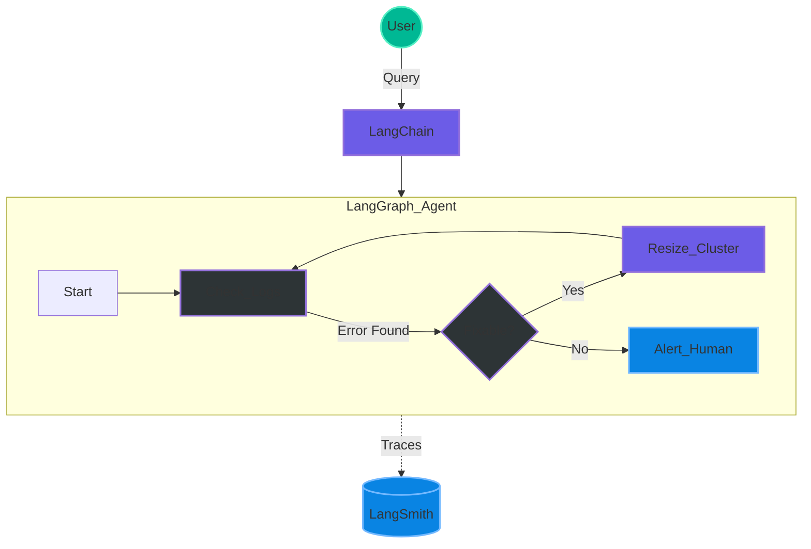

# LangChain Ecosystem

This note covers the LangChain ecosystem, specifically comparing **LangChain**, **LangGraph**, and **LangSmith**. It explains how these tools work together to build everything from simple bots to complex, autonomous AI agents.

## The Framework Breakdown

- **LangChain (Linear Workflows):**
 - Best for **predefined, linear paths** called "chains."
 - The LLM follows a specific sequence (e.g., fetching a document and then summarizing it) without making autonomous decisions on the process flow.
 - **Use Case:** A basic E-commerce chatbot that answers policy questions using Retrieval Augmented Generation (RAG).

- **LangGraph (Complex Agents):**
 - An orchestration framework designed for **stateful, iterative workflows**.
 - Unlike linear chains, LangGraph allows for **loops and retries**, enabling the LLM to act as an "agent" that can reason, plan, and adjust its steps autonomously.
 - **Use Case:** A multi-step exchange request that requires checking order databases, SKU availability, and printing shipping labels.

- **LangSmith (Observability):**
 - The "control room" for your AI applications.
 - It is used for **debugging, tracing, and monitoring** performance metrics like latency and token costs (e.g., tracking a call that used 390 tokens).

## Key Concepts & Examples

- **Retrieval Augmented Generation (RAG):** The process of chunking private organizational data and storing it in vector databases so an LLM can access specific context for its answers.

- **Stock Transaction Graph:** An example of a LangGraph implementation where the LLM uses a custom Python tool to fetch real-time stock prices and calculate transaction totals based on user input.

## Conclusion: Which Tool to Use?

- **LangChain:** For simple, predictable, linear tasks.
- **LangGraph:** For complex tasks requiring multi-step reasoning and feedback loops.
- **LangSmith:** Always used alongside the others to monitor and debug the system in production.
- **LlamaIndex:** Traditionally the go-to for "data-centric" AI. It excels at connecting LLMs to various data sources (PDFs, APIs, databases) and is highly optimized for complex **RAG** pipelines.

| AI Component (sklearn) | Data Engineering/Machine Learning Equivalent |
| ---------------------- | -------------------------------------------- |
| **TfidfVectorizer** | Feature Engineering / Tokenization (like transforming text cols in Spark ML) |
| **cosine_similarity** | Distance Metric (like K-Nearest Neighbors logic) |
| **VectorMemory Class** | In-Memory Search Index (like a tiny, local Elasticsearch) |

---

## 👷 Principal Engineer's Deep Dive

### 1. Concept Definition
**LangChain** is the "glue" for linear LLM applications (A → B → C).
**LangGraph** is the "state machine" for agents, allowing loops, retries, and conditional logic (A → B → if fail retry A).
**LangSmith** is the "observability platform" (Datadog for LLMs) to trace latency, token usage, and errors.

### 2. Real-time Data Engineering Implementation
*"How would I implement this in a Data Platform?"*

Imagine an **Auto-Remediation Bot** for pipeline failures:
1. **LangChain**: Simple linear chain. Receive Alert → Summarize Error → Slack it.
2. **LangGraph**: Stateful Agent.
 - Node A: Check Error Log.
 - Node B: Is it a "Memory Error"?
 - Yes → Node C: Increase cluster size → Node D: Rerun Job.
 - Loop: Check status again.
3. **LangSmith**: Monitor the agent to ensure it didn't spend $50 in API calls looping infinitely.

### 3. Syntax (LangGraph State)
```python
from langgraph.graph import StateGraph
from typing import TypedDict

class AgentState(TypedDict):
 input: str
 messages: list

workflow = StateGraph(AgentState)
workflow.add_node("check_logs", check_logs_tool)
workflow.add_node("resize_cluster", resize_cluster_tool)

# Define the loop/edge
workflow.add_conditional_edges(
 "check_logs",
 should_resize,
 {
 "resize": "resize_cluster",
 "end": END
 }
)
```

### 4. Visualization

