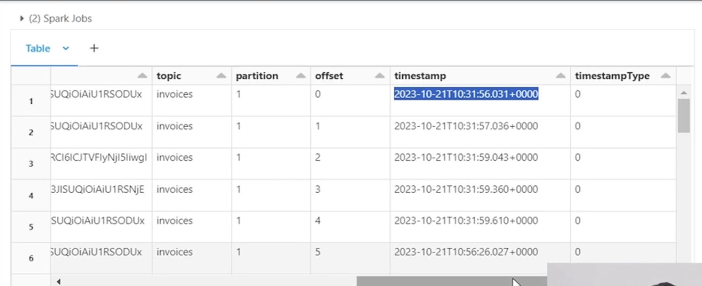
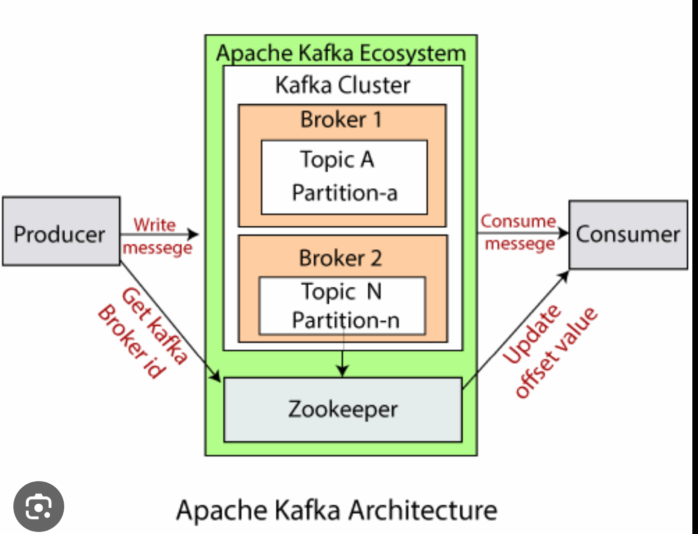

---


tags:
 - streaming
---

	- Kafka version -> 0.11.0.X and Confluent Platform 3.x
		- **Confluent Platform 3.x Components:***
		 collapsed:: true
			- **Kafka Connect:**
			 A framework for building connectors to stream data between Kafka and
			 external systems (databases, filesystems, etc.).
			- **Kafka Streams:**
			 A library for building real-time stream processing applications on top of
			 Kafka.
			- **SchemaRegistry:**
			 A central repository for storing and managing Avro schemas for messages in
			 Kafka topics, ensuring data compatibility.
			- **RESTProxy:**
			 component that provides a RESTful interface for interacting with Kafka,
			 making it easier to integrate with web applications.
			- **ControlCenter:**
			 web-based monitoring and management console for Kafka clusters and
			 Confluent Platform components.
			- The Kafka MirrorMaker (MM1 , MM2 )provides Geo-replication support for clusters. The messages are replicated across multiple cloud regions or datacenters. This can be used in passive/active scenarios for recovery and backup.
		- rabit MQ vs kafka MQ main differenece?
		 collapsed:: true
			- **Messaging Model**
			 RabbitMQ follows a traditional message broker model with a push-based approach, where messages are pushed to consumers[1](https://www.logicmonitor.com/blog/rabbitmq-vs-kafka)[2](https://www.upsolver.com/blog/kafka-versus-rabbitmq-architecture-performance-use-case)[5](https://www.openlogic.com/blog/kafka-vs-rabbitmq). Kafka follows a distributed log/commit log model with a pull-based approach, where consumers pull messages from topics[1](https://www.logicmonitor.com/blog/rabbitmq-vs-kafka)[2](https://www.upsolver.com/blog/kafka-versus-rabbitmq-architecture-performance-use-case)[5](https://www.openlogic.com/blog/kafka-vs-rabbitmq).
			- **Throughput and Performance**
			 Kafka is designed for high throughput and can handle millions of messages per second, making it suitable for big data and stream processing use cases[1](https://www.logicmonitor.com/blog/rabbitmq-vs-kafka)[4](https://www.site24x7.com/learn/kafka-vs-rabbitmq.html)[5](https://www.openlogic.com/blog/kafka-vs-rabbitmq). RabbitMQ has comparatively lower throughput, typically in the range of thousands of messages per second[1](https://www.logicmonitor.com/blog/rabbitmq-vs-kafka)[5](https://www.openlogic.com/blog/kafka-vs-rabbitmq).
			- **Message Ordering and Delivery Semantics**
			 In Kafka, messages are ordered within a partition, but there are no guarantees across partitions[3](https://stackoverflow.com/questions/42151544/when-to-use-rabbitmq-over-kafka). RabbitMQ can provide stronger ordering guarantees through queues[3](https://stackoverflow.com/questions/42151544/when-to-use-rabbitmq-over-kafka). Kafka provides at-least-once delivery semantics, while RabbitMQ supports at-least-once and at-most-once delivery[2](https://www.upsolver.com/blog/kafka-versus-rabbitmq-architecture-performance-use-case).
			- **Data Retention and Replayability**
			 Kafka acts as a distributed commit log and retains messages for a configured period, allowing data replayability[1](https://www.logicmonitor.com/blog/rabbitmq-vs-kafka)[2](https://www.upsolver.com/blog/kafka-versus-rabbitmq-architecture-performance-use-case)[4](https://www.site24x7.com/learn/kafka-vs-rabbitmq.html). RabbitMQ is primarily a message broker, and messages are typically deleted after consumption unless explicitly persisted[2](https://www.upsolver.com/blog/kafka-versus-rabbitmq-architecture-performance-use-case).
			- **Scalability**
			 Kafka is designed to be highly scalable, with partitions distributed across multiple brokers[1](https://www.logicmonitor.com/blog/rabbitmq-vs-kafka)[5](https://www.openlogic.com/blog/kafka-vs-rabbitmq). RabbitMQ can be scaled vertically by adding more resources or horizontally through clustering and federation, but with more operational complexity[5](https://www.openlogic.com/blog/kafka-vs-rabbitmq).
			- **Consumer Model**
			 RabbitMQ follows a "smart broker, dumb consumer" model where the broker handles message routing and delivery[2](https://www.upsolver.com/blog/kafka-versus-rabbitmq-architecture-performance-use-case)[5](https://www.openlogic.com/blog/kafka-vs-rabbitmq). Kafka follows a "dumb broker, smart consumer" model where consumers control their consumption and offset management[2](https://www.upsolver.com/blog/kafka-versus-rabbitmq-architecture-performance-use-case)[5](https://www.openlogic.com/blog/kafka-vs-rabbitmq).
			
			 In summary, while both are messaging systems, Kafka is optimized for high-throughput streaming data pipelines with replayability, while RabbitMQ is a more traditional message broker focused on reliable delivery and flexible routing[1](https://www.logicmonitor.com/blog/rabbitmq-vs-kafka)[2](https://www.upsolver.com/blog/kafka-versus-rabbitmq-architecture-performance-use-case)[4](https://www.site24x7.com/learn/kafka-vs-rabbitmq.html)[5](https://www.openlogic.com/blog/kafka-vs-rabbitmq). The choice depends on the specific requirements of throughput, ordering, scalability, and data retention in your use case.
		- Key and value are serialized as a :-> "ByteArray". ^664646ab-7290-4678-ad08-b1884df5a44b
		- Important parts of kafka packet :-> key,value,timestamp ^664646ab-fbba-48f5-a69b-e60445b04e48
		- offset :-> In partitions, messages are assigned a unique ID number ^664646ab-4207-448d-b062-8d7a4808b096
		- 
		-
			- Can Kafka be used without ZooKeeper ? below 2.5 version No .
				- Yes, Kafka can now be used without ZooKeeper, starting with Apache Kafka version 2.8.0 and becoming fully supported in version 3.5.0 but relatively new . can recommend for production . Its called (KRaft (Kafka Raft) mode.)
			- partitioning key
				- The partitioning key indicates the destination partition of the message within the producer. A hashing based partitioner determines the partition ID when the key is given.
				- Kafka uses a hashing function (e.g. murmur2 hash) to map the key to a specific partition number within the topic. The formula is: partition = murmur2(key) % number_of_partitions
			- QueueFullException occurs when the producer attempts to send messages at a pace not handleable by the broker.
			- Partition is a single piece of Kafka topic. More partitions allow excellent parallelism when reading from the topics. The number of partitions is configured based on per topic.
				- 
			- ISR is the abbreviation of In sync replicas.They are a set of message replicas that are synced to be leaders. https://gautambangalore.medium.com/knowing-and-valuing-apache-kafkas-isr-in-sync-replicas-167bf8c76cc1
			- How can you get precisely one messaging during data production/Dedup
				- To get precisely one messaging from data production, you have to follow two things avoiding duplicates during data production and avoiding duplicates during data consumption. For this, include a primary key in the message and de-duplicate on the consumer.
			- Zookeeper in Kafka :->It is a high performance and open source complete coordination service used for distributed applications adapted by Kafka. It lets Kafka manage sources properly. ^664646ab-d7e2-4471-97d4-5f219a036bcc
			- replica in the Kafka environment :->The replica is a list of essential nodes needed for logging for any particular partition. It can play the role of a follower or leader. ^664646ab-f134-4ca9-9390-0c53fb57cd35
			- consumer group :-> When more than one consumer consumes a bunch of subscribed topics jointly, it forms a consumer group. ^664646ab-ca74-4c4e-84a7-078f01e1468c
			- start a Kafka Server:->
				- To start a Kafka Server, the Zookeeper has to be powered up by using the following steps:
				- bin/zookeeper-server-start.sh config/zookeeper.properties
				- bin/kafka-server-start.sh config/server.properties
			- replications dangerous in Kafka :-> duplication assures that issued messages ^664646ab-6cfa-49d0-bb8b-def141abb016
			- The Kafka Producer API provides two main modes of operation
				- SyncProducer provides stronger ordering and durability guarantees at the cost of lower throughput, while AsyncProducer favors higher throughput over strict ordering and durability. The choice depends on the specific requirements of the use case.
				- ## Synchronous (SyncProducer)
				- The `send()` method blocks until it receives acknowledgment from Kafka brokers based on the `acks` configuration[1](https://stackoverflow.com/questions/67924473/difference-between-kafka-async-and-kafka-sync-acks-0)[3](https://kafka.apache.org/22/javadoc/org/apache/kafka/clients/producer/KafkaProducer.html).
				- With `acks=all`, it blocks until the message is committed to the leader and all in-sync replicas[3](https://kafka.apache.org/22/javadoc/org/apache/kafka/clients/producer/KafkaProducer.html)[4](https://docs.confluent.io/platform/current/clients/producer.html).
				- Provides stronger durability guarantees as the producer waits for replication acknowledgments[4](https://docs.confluent.io/platform/current/clients/producer.html).
				- Ordering of messages is guaranteed if they have the same key, as the producer blocks for each batch[5](https://www.reddit.com/r/apachekafka/comments/w8mqng/when_would_you_want_to_use_a_sync_producer_over/).
				- Lower throughput compared to async due to blocking[1](https://stackoverflow.com/questions/67924473/difference-between-kafka-async-and-kafka-sync-acks-0)[4](https://docs.confluent.io/platform/current/clients/producer.html).
				- Suitable for use cases that require strict ordering and durability like financial transactions[5](https://www.reddit.com/r/apachekafka/comments/w8mqng/when_would_you_want_to_use_a_sync_producer_over/).
				- ## Asynchronous (AsyncProducer)
				- The `send()` method returns a Future and does not block[1](https://stackoverflow.com/questions/67924473/difference-between-kafka-async-and-kafka-sync-acks-0)[3](https://kafka.apache.org/22/javadoc/org/apache/kafka/clients/producer/KafkaProducer.html).
				- Messages are added to a buffer and sent in batches in the background[3](https://kafka.apache.org/22/javadoc/org/apache/kafka/clients/producer/KafkaProducer.html)[4](https://docs.confluent.io/platform/current/clients/producer.html).
				- A callback can be provided to handle success or failure for each message[1](https://stackoverflow.com/questions/67924473/difference-between-kafka-async-and-kafka-sync-acks-0)[3](https://kafka.apache.org/22/javadoc/org/apache/kafka/clients/producer/KafkaProducer.html).
				- Higher throughput compared to sync as it does not block[1](https://stackoverflow.com/questions/67924473/difference-between-kafka-async-and-kafka-sync-acks-0)[4](https://docs.confluent.io/platform/current/clients/producer.html).
				- Message ordering is not strictly guaranteed, even for the same key[5](https://www.reddit.com/r/apachekafka/comments/w8mqng/when_would_you_want_to_use_a_sync_producer_over/).
				- Provides lower durability guarantees as messages may be accepted without replication[4](https://docs.confluent.io/platform/current/clients/producer.html).
				- Suitable for high throughput use cases where strict ordering is not critical[5](https://www.reddit.com/r/apachekafka/comments/w8mqng/when_would_you_want_to_use_a_sync_producer_over/).
			- Is getting message offset possible after producing?
				- This is not possible from a class behaving as a producer because, like in most queue systems, its role is to forget and fire the messages. As a message consumer, you get the offset from a Kaka broker.
			- Rebalancing Kafka
				- Rebalancing a Kafka cluster involves redistributing the partitions and their replicas across the brokers to achieve an optimal balance. Here are the key steps to rebalance a Kafka cluster:
				- **Identify Imbalance**
				 Monitor metrics like partition distribution, CPU/disk/network utilization across brokers to identify imbalances. Common causes are adding/removing brokers, uneven partition/replica distribution, or skewed workloads.[1](https://blog.hawk-tech.io/rebalancing-kafkas-partitions-803918d8d244?gi=d71239d8a800)[4](https://developers.redhat.com/articles/2023/07/05/how-use-kafka-cruise-control-cluster-optimization)
				- **Generate Reassignment Plan**
				 Use the `kafka-reassign-partitions` tool to generate a proposed reassignment plan in JSON format. This can be done by providing a list of topics to reassign, or by letting the tool analyze the current state.[3](https://strimzi.io/blog/2022/09/16/reassign-partitions/)
				
				 ```
				 kafka-reassign-partitions --bootstrap-server broker1:9092 --topics-to-move-json-file topics.json --generate
				 ```
				- **Review and Modify Plan**
				 Review the generated reassignment plan. Optionally modify it to exclude certain brokers/topics, set a bandwidth throttle rate, or make other adjustments based on requirements.[3](https://strimzi.io/blog/2022/09/16/reassign-partitions/)[4](https://developers.redhat.com/articles/2023/07/05/how-use-kafka-cruise-control-cluster-optimization)
				- **Execute Reassignment**
				 Execute the reassignment plan using the same tool with the `--execute` option and the modified JSON file.[3](https://strimzi.io/blog/2022/09/16/reassign-partitions/)
				
				 ```
				 kafka-reassign-partitions --bootstrap-server broker1:9092 --reassignment-json-file reassignment.json --execute
				 ```
				- **Verify Reassignment Progress**
				 Continuously verify the reassignment progress using the `--verify` option until it completes successfully for all partitions.[3](https://strimzi.io/blog/2022/09/16/reassign-partitions/)
				
				 ```
				 kafka-reassign-partitions --bootstrap-server broker1:9092 --reassignment-json-file reassignment.json --verify
				 ```
				- **Adjust Configurations (Optional)**
				 After reassignment, you may need to adjust configurations like increasing replication factor for topics that had leaders on removed brokers.[2](https://www.wix.engineering/post/4-steps-for-kafka-rebalance-notes-from-the-field)
				
				 It's crucial to carefully plan and execute the reassignment to minimize impact on running workloads. Setting an appropriate throttle rate and verifying progress is recommended for large clusters with high throughput.
			- Kafka protocol :
				- Kafka leverages the reliable TCP protocol for communication between its brokers (servers) and producers/consumers (clients). The clients initiate TCP connections to brokers and exchange binary protocol requests/responses over these connections to publish/consume data streams[1](https://kafka.apache.org/protocol.html)[2](https://engineering.vendavo.com/kafkas-high-throughput-and-resilience-a-technical-insight-into-kafka-s-communication-and-broker-4d309ce4b200?gi=bb5682c80f12). The use of TCP ensures ordered, reliable data delivery between the distributed components.
			- log cleaner configured
			 collapsed:: true
				- bin/kafka-topics.sh --bootstrap-server broker1:9092 --create --topic compacted-topic --partitions 3 --replication-factor 2 --config cleanup.policy=compact
			- broker configuration files :-> broker.id, log.dirs, zookeeper.connect. ^664646ab-3123-4027-b253-57950fc78b05
				- /path/to/kafka/config/server.properties
			- Server in Kafka cluster -> broker in Kafka
			- maximum message size can the Kafka server receive :-> ^664646ab-6a86-4e26-8bd7-7d263e4bf8be
			 collapsed:: true
				- Specifically:
				- The `message.max.bytes` setting determines the largest record batch size allowed by Kafka, after compression if compression is enabled[1](https://stackoverflow.com/questions/50207715/where-to-set-maximum-message-size-in-apache-kafka)[2](https://kafka.apache.org/081/documentation.html)[4](https://www.linkedin.com/pulse/kakfa-large-messages-marwa-ali).
				- It is a broker configuration property that needs to be set in the `server.properties` file[1](https://stackoverflow.com/questions/50207715/where-to-set-maximum-message-size-in-apache-kafka)[4](https://www.linkedin.com/pulse/kakfa-large-messages-marwa-ali).
				- The default value for `message.max.bytes` is 1,000,000 bytes (1 MB)[2](https://kafka.apache.org/081/documentation.html)[4](https://www.linkedin.com/pulse/kakfa-large-messages-marwa-ali).
				- If you want to allow larger messages, you need to increase the `message.max.bytes` value in the broker configuration[1](https://stackoverflow.com/questions/50207715/where-to-set-maximum-message-size-in-apache-kafka)[4](https://www.linkedin.com/pulse/kakfa-large-messages-marwa-ali).
				- It is important to keep the `message.max.bytes` setting in sync with the maximum fetch size used by consumers, so they can fetch record batches of this large size[2](https://kafka.apache.org/081/documentation.html)[4](https://www.linkedin.com/pulse/kakfa-large-messages-marwa-ali).
				- For consumers prior to version 0.10.2, if `message.max.bytes` is increased, the `max.partition.fetch.bytes` consumer configuration also needs to be increased accordingly[1](https://stackoverflow.com/questions/50207715/where-to-set-maximum-message-size-in-apache-kafka).
				
				 So in summary, the `message.max.bytes` broker configuration property controls the maximum message size the Kafka server can receive, with the default being 1 MB. Increasing this value allows handling larger messages, but requires adjusting consumer configurations as well
			- How can the throughput of a remote consumer be improved :->
				- If the consumer is not located in the same data center as the broker, it requires tuning the socket buffer size to amortize the long network latency.
				- To improve the throughput of a remote Kafka consumer that is not located in the same data center as the broker, tuning the socket buffer size can help amortize the long network latency. Here's how it works:
				- When a consumer fetches data from a remote broker over a network, there is inherent network latency involved in the round-trip communication.
				- By default, the socket buffer sizes (send and receive buffers) are relatively small, which means the consumer has to make frequent network requests to fetch data from the remote broker.
				- Each network request incurs the round-trip latency penalty, which can significantly impact the overall throughput, especially over long-distance networks with higher latencies.
				- To mitigate this, increasing the socket buffer sizes allows the consumer to fetch larger batches of data in fewer network requests[1](https://www.rabbitmq.com/docs/networking).
				- With larger socket buffers, the consumer can fetch more data per network request, thereby amortizing the network latency over a larger data transfer.
				- This reduces the number of network round-trips required to transfer the same amount of data, improving the overall throughput.
				- The socket buffer sizes can be increased by setting the `socket.receive.buffer.bytes` and `socket.send.buffer.bytes` consumer configuration properties to larger values (e.g., 1MB or higher, depending on the network conditions).
				
				 So, by tuning the socket buffer sizes to fetch larger batches of data per network request, remote consumers can effectively reduce the impact of network latency on throughput when communicating with brokers over long-distance networks[1](https://www.rabbitmq.com/docs/networking). However, it's important to find the right balance, as excessively large buffer sizes can also lead to increased memory usage and potential issues.
			- How can churn be reduced in ISR, and when does the broker leave it?
			 collapsed:: true
				- ISR has all the committed messages. It should have all replicas till there is a real failure. A replica is dropped out of ISR if it deviates from the leader.
			- If replica stays out of ISR for a long time, what is indicated?
			 collapsed:: true
				- If a replica is staying out of ISR for a long time, it indicates the follower cannot fetch data as fast as data is accumulated at the leader.
				- If a replica stays out of the in-sync replica (ISR) set for a long time, it indicates that the follower replica is unable to keep up with the leader and cannot fetch data as fast as data is being produced and accumulated at the leader.This situation can arise due to several reasons:
				- **Slow Follower Replica**
				 The follower replica may be experiencing performance issues, such as I/O bottlenecks, network issues, or resource constraints (CPU, memory, disk), causing it to lag behind the leader in replicating data.
				- **Network Congestion/Latency**
				 High network latency or congestion between the leader and follower replicas can slow down the replication process, causing the follower to fall behind.
				- **High Produce Rate**
				 If the rate at which data is being produced and written to the leader is extremely high, the follower may struggle to keep up, especially if it has limited resources or network bandwidth.
				
				 To fix this issue and bring the replica back into the ISR, you can consider the following steps:
				- **Identify and Resolve Performance Bottlenecks**
				 Investigate the follower replica's performance metrics (CPU, memory, disk I/O, network) and identify any bottlenecks. Resolve these issues by allocating more resources, optimizing configurations, or addressing any underlying hardware or network problems.
				- **Increase Replication Throughput**
				 You can try increasing the replication throughput by adjusting the following configurations:
					- Increase `replica.fetch.max.bytes` to allow larger fetch requests from the follower.
					- Increase `num.replica.fetchers` to use more threads for replicating data.
					- Increase `replica.socket.receive.buffer.bytes` and `replica.socket.send.buffer.bytes` to improve network throughput.
				- **Throttle Produce Rate**
				 If the produce rate is extremely high and the follower cannot keep up, you may need to temporarily throttle the produce rate using the `producer.max.rate` configuration. This can give the follower time to catch up before resuming normal operation.
				- **Restart the Follower Broker**
				 In some cases, restarting the follower broker may help resolve any transient issues or clear up any stuck state that prevented it from catching up with the leader.
				- **Increase `replica.lag.time.max.ms`**
				 As a temporary measure, you can increase the `replica.lag.time.max.ms` configuration to give the follower more time to catch up before being removed from the ISR. However, this should be done with caution, as it increases the potential for data loss if the follower fails.
			- What happens if the preferred replica is not in the ISR?
			 collapsed:: true
				- The controller will fail to move leadership to the preferred replica if it is not in the ISR.
				- Here's an explanation of what happens in this scenario:
				- In Kafka, each partition has a preferred replica (leader) that acts as the leader by default when the cluster is balanced.
				- The ISR is the set of replicas (including the leader) that are fully caught up with the leader's log for that partition.
				- When leadership needs to be transferred, for example during a broker failure or rebalance, the controller attempts to move leadership to the preferred replica if it is part of the ISR[1](https://stackoverflow.com/questions/63917374/is-the-leader-part-of-isr-list).
				- However, if the preferred replica is not in the ISR, it means that replica is lagging behind or out-of-sync with the current leader's log[2](https://www.cloudkarafka.com/blog/what-does-in-sync-in-apache-kafka-really-mean.html)[3](https://cwiki.apache.org/confluence/display/KAFKA/KIP-501%2BAvoid%2Bout-of-sync%2Bor%2Boffline%2Bpartitions%2Bwhen%2Bfollower%2Bfetch%2Brequests%2Bare%2Bnot%2Bprocessed%2Bin%2Btime).
				- In such a case, the controller will not be able to move leadership to the preferred replica because it does not have the latest committed data[1](https://stackoverflow.com/questions/63917374/is-the-leader-part-of-isr-list)[3](https://cwiki.apache.org/confluence/display/KAFKA/KIP-501%2BAvoid%2Bout-of-sync%2Bor%2Boffline%2Bpartitions%2Bwhen%2Bfollower%2Bfetch%2Brequests%2Bare%2Bnot%2Bprocessed%2Bin%2Btime).
				- Instead, the controller will elect one of the other replicas that is part of the ISR as the new leader for that partition[1](https://stackoverflow.com/questions/63917374/is-the-leader-part-of-isr-list)[3](https://cwiki.apache.org/confluence/display/KAFKA/KIP-501%2BAvoid%2Bout-of-sync%2Bor%2Boffline%2Bpartitions%2Bwhen%2Bfollower%2Bfetch%2Brequests%2Bare%2Bnot%2Bprocessed%2Bin%2Btime).
				- This is done to ensure data consistency and prevent potential data loss that could occur if leadership was transferred to an out-of-sync replica.
				
				 So in summary, if the preferred replica is not in the ISR, it indicates that replica is not fully caught up with the leader's log. To maintain data integrity, the controller will skip the preferred replica and elect a different replica from the ISR as the new leader for that partition[1](https://stackoverflow.com/questions/63917374/is-the-leader-part-of-isr-list)[2](https://www.cloudkarafka.com/blog/what-does-in-sync-in-apache-kafka-really-mean.html)[3](https://cwiki.apache.org/confluence/display/KAFKA/KIP-501%2BAvoid%2Bout-of-sync%2Bor%2Boffline%2Bpartitions%2Bwhen%2Bfollower%2Bfetch%2Brequests%2Bare%2Bnot%2Bprocessed%2Bin%2Btime). This ensures the new leader has the latest committed data.
			- What is meant by SerDes?
				- SerDes (Serializer and Deserializer) materializes the data whenever necessary for any Kafka stream when SerDes is provided for all record and record values.
			- What do you understand by multi-tenancy
			 collapsed:: true
				- Multi-tenancy in Apache Kafka refers to the ability to share a single Kafka cluster across multiple isolated tenants or applications, while providing logical separation and access control for each tenant's data and resources.In a multi-tenant Kafka deployment, the key aspects are:
				- **Data Isolation**
					- Each tenant's data (topics, messages) is logically isolated from other tenants.
					- This is achieved by using separate Kafka topics or by leveraging topic naming conventions (e.g., prefixes) for each tenant.
					- Tenants can only produce/consume messages to/from their designated topics.
				- **Access Control**
					- Kafka's built-in security features like authentication and authorization are used to control access to topics and other resources.
					- Each tenant is assigned specific roles or ACLs (Access Control Lists) that determine their permissions.
					- Tenants can only access the topics and resources they are authorized for.
				- **Namespace Isolation**
					- Kafka supports namespace isolation by allowing tenants to have separate consumer groups.
					- This ensures that consumer offsets and rebalancing are isolated per tenant, even when consuming from shared topics.
				- **Performance Isolation**
					- Kafka can be configured to provide performance isolation by setting quotas or throttling limits on produce/consume rates for each tenant.
					- This prevents noisy neighbors from impacting other tenants' performance.
					
					 To enable multi-tenancy in Kafka, you typically configure the following[1](https://www.confluent.io/blog/cloud-native-multi-tenant-kafka-with-confluent-cloud/)[2](https://doordash.engineering/2024/03/27/setting-up-kafka-multi-tenancy/)[4](https://devcenter.heroku.com/articles/multi-tenant-kafka-on-heroku):
				- Use separate topics or topic naming conventions (e.g., prefixes) for each tenant's data.
				- Set up authentication (e.g., SSL, SASL) and authorization (ACLs) to restrict tenant access to specific topics/resources.
				- Configure separate consumer groups for each tenant to isolate offsets and rebalancing.
				- Optionally, set quotas or throttling limits per tenant for performance isolation.
				
				 By deploying Kafka in a multi-tenant manner, you can efficiently share the cluster resources across multiple applications or teams, while maintaining secure data isolation, access control, and performance guarantees for each tenant[1](https://www.confluent.io/blog/cloud-native-multi-tenant-kafka-with-confluent-cloud/)[2](https://doordash.engineering/2024/03/27/setting-up-kafka-multi-tenancy/)[4](https://devcenter.heroku.com/articles/multi-tenant-kafka-on-heroku). This allows for better resource utilization and reduces the operational overhead of managing multiple separate Kafka clusters.
			- How is Kafka tuned for optimal performance?
				- ## Partition and Consumer Group Tuning
				- **Increase Number of Partitions**
				 More partitions allow greater parallelism and higher throughput. A general guideline is:
				
				 ```
				 Number of Partitions = Desired Throughput / Single Partition Throughput
				 ```
				
				 Where a single partition can typically handle around 10 MB/s.[1](https://dattell.com/data-architecture-blog/kafka-performance-tuning/)[3](https://redpanda.com/guides/kafka-performance/kafka-optimization)
				- **Match Number of Consumer Threads to Partitions**
				 Keep the number of consumer threads/instances less than or equal to the number of partitions to avoid contention.[1](https://dattell.com/data-architecture-blog/kafka-performance-tuning/)[3](https://redpanda.com/guides/kafka-performance/kafka-optimization)
				- ## Broker/Cluster Tuning
				- **Optimize Cluster Size**
				 Ensure you have an appropriately sized Kafka cluster (number of brokers) to handle your throughput requirements and provide redundancy.[3](https://redpanda.com/guides/kafka-performance/kafka-optimization)
				- **Tune Replication Factor and Min.Insync.Replicas**
				 Set replication factor (e.g. 3) and min.insync.replicas (e.g. 2) to balance durability and availability based on your needs.[2](https://developers.redhat.com/articles/2022/05/03/fine-tune-kafka-performance-kafka-optimization-theorem)
				- ## Producer Tuning
				- **Increase Batch Size**
				 Configure larger producer batch sizes (e.g. 1KB minimum) to reduce request overhead and improve throughput.[1](https://dattell.com/data-architecture-blog/kafka-performance-tuning/)[3](https://redpanda.com/guides/kafka-performance/kafka-optimization)
				- **Tune Linger.ms**
				 Set an appropriate linger.ms value (e.g. 20ms) to allow batching without excessive latency.[1](https://dattell.com/data-architecture-blog/kafka-performance-tuning/)[3](https://redpanda.com/guides/kafka-performance/kafka-optimization)
				- **Enable Compression**
				 Enable compression (e.g. snappy, gzip) to reduce network overhead at the cost of higher CPU usage.[3](https://redpanda.com/guides/kafka-performance/kafka-optimization)
				- **Tune Acks Configuration**
				 Adjust acks settings (0, 1, all) to trade off durability for lower latency/higher throughput.[3](https://redpanda.com/guides/kafka-performance/kafka-optimization)
				- ## Consumer Tuning
				- **Increase Consumer Fetch Size**
				 Increase consumer fetch sizes to match producer batch sizes and reduce request overhead.[4](https://granulate.io/blog/optimizing-kafka-performance/)
				- **Monitor Performance Metrics**
				 Continuously monitor key metrics like throughput, latency, error rates, buffer utilization to identify bottlenecks and tune accordingly.[4](https://granulate.io/blog/optimizing-kafka-performance/)[5](https://www.linkedin.com/advice/0/how-do-you-optimize-kafka-producer-settings-high)
				
				 The optimal configuration will depend on your specific throughput, latency, durability, and availability requirements. Monitoring and iterative tuning is crucial to achieve the desired performance characteristics.
			- Tell us the cases where Kafka does not fit
			 collapsed:: true
				- Answer
				
				 Based on the provided search results, there are a few key scenarios where Apache Kafka may not be the ideal fit:
				- **Low Throughput Requirements**
				 If your application has relatively low throughput requirements, the overhead of managing and operating a distributed system like Kafka may outweigh the benefits. For low-volume data streams, simpler messaging solutions like RabbitMQ or AWS SQS could be more suitable[1](https://www.confluent.io/blog/how-to-survive-a-kafka-outage/).
				- **Strict Ordering Requirements**
				 While Kafka provides ordering guarantees within a partition, if your use case requires strict ordering across all messages, regardless of partition, Kafka may not be the best choice. In such cases, a traditional message queue like RabbitMQ or Amazon MQ could be a better fit[1](https://www.confluent.io/blog/how-to-survive-a-kafka-outage/).
				- **Short-Lived Data Streams**
				 Kafka is designed for durable storage of data streams, with the ability to replay data. If your use case involves short-lived, transient data that doesn't need to be persisted or replayed, Kafka's disk-based storage may be unnecessary overhead[1](https://www.confluent.io/blog/how-to-survive-a-kafka-outage/).
				- **Simple Point-to-Point Communication**
				 For simple point-to-point communication between two applications, Kafka's distributed architecture may be overkill. Lightweight messaging solutions like Redis Streams or ZeroMQ could be more appropriate[1](https://www.confluent.io/blog/how-to-survive-a-kafka-outage/).
				- **High Message Ordering Requirements**
				 If your application requires strict ordering of messages across multiple partitions or topics, Kafka may not be the best choice. Kafka only guarantees ordering within a single partition[3](https://developers.redhat.com/articles/2022/05/03/fine-tune-kafka-performance-kafka-optimization-theorem).
				- **Small Data Payloads**
				 Kafka is optimized for handling large data payloads efficiently. If your application deals primarily with small message payloads (e.g., sensor data, IoT events), the overhead of Kafka's architecture may outweigh its benefits[4](https://pandio.com/top-10-problems-when-using-apache-kafka/).
				- **Simple Queuing Requirements**
				 For simple queuing use cases where advanced features like replication, partitioning, and fault tolerance are not required, lightweight message queues like RabbitMQ or Amazon SQS could be more suitable than the complexity of Kafka[4](https://pandio.com/top-10-problems-when-using-apache-kafka/).
				
				 It's important to note that Kafka is a powerful and scalable distributed streaming platform, but it may not be the best fit for every use case. Carefully evaluating your specific requirements, such as throughput, ordering, data durability, and messaging patterns, can help determine if Kafka is the right choice or if alternative messaging solutions would be more appropriate.
			- There are three ack settings available:
			- Kafka producer Acknowledgement
				- **acks=0 (Fire and Forget)**
				 The producer does not wait for any acknowledgement from the broker. The message is immediately considered sent, but there is no guarantee that it was actually received and persisted by the broker. This provides the lowest latency but highest risk of data loss.[1](https://www.geeksforgeeks.org/apache-kafka-producer-acknowledgement-and-min-insync-replicas/)[3](https://stackoverflow.com/questions/44992566/kafka-producer-acknowledgement)[4](https://www.scaler.com/topics/kafka-tutorial/kafka-message-acknowledgement/)
				- **acks=1 (Leader Acknowledgement)**
				 The producer considers the message as sent once the leader broker acknowledges that it has received and persisted the message to its local log. However, the message may still be lost if the leader fails before replicating it to its followers. This strikes a balance between latency and durability.[1](https://www.geeksforgeeks.org/apache-kafka-producer-acknowledgement-and-min-insync-replicas/)[3](https://stackoverflow.com/questions/44992566/kafka-producer-acknowledgement)[4](https://www.scaler.com/topics/kafka-tutorial/kafka-message-acknowledgement/)
				- **acks=all (Full Acknowledgement)**
				 The producer waits for all in-sync replica brokers to acknowledge that they have received the message before considering it sent. This provides the highest durability guarantee as the message will not be lost as long as at least one in-sync replica remains alive. However, it has the highest latency compared to the other ack modes.
				- ```scala
				 Properties props = new Properties(); This is java block
				 props.put("bootstrap.servers", "broker1:9092,broker2:9092");
				 props.put("acks", "0"); // Set acks=0 for fire and forget
				 props.put("key.serializer", "org.apache.kafka.common.serialization.StringSerializer");
				 props.put("value.serializer", "org.apache.kafka.common.serialization.StringSerializer");
				
				 Producer<String, String> producer = new KafkaProducer<>(props);
				 ```
				- id:: 66463615-f74e-4ec9-aa64-48a21ac6c9a9
				 ```python
				 from kafka import KafkaProducer
				
				 producer = KafkaProducer(bootstrap_servers=['broker1:9092','broker2:9092'],
				 acks=0) # Set acks=0 for fire and forget
				 ```
			- What is a Smart producer/ dumb broker?
				- RabbitMQ follows a "smart broker, dumb consumer" model where the broker handles message routing and delivery[2](https://www.upsolver.com/blog/kafka-versus-rabbitmq-architecture-performance-use-case)[5](https://www.openlogic.com/blog/kafka-vs-rabbitmq). Kafka follows a "dumb broker, smart consumer" model where consumers control their consumption and offset management
				-