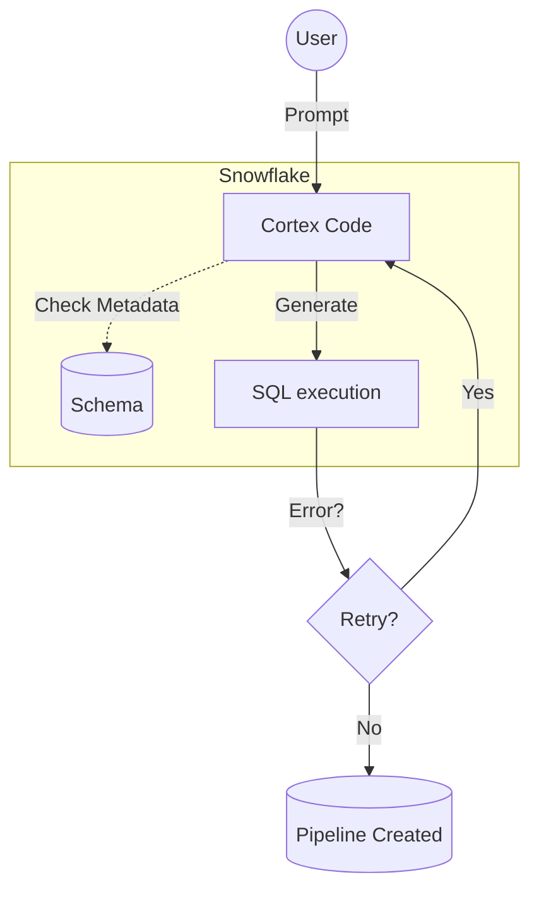

---
[New Entry]
created_at: "2026-02-04 13:46"
status: sapling
processed: true
Explain: true
tags:
 - warehousing
examples:
 - dataengineering[1]: [Declarative Pipeline with Dynamic Tables]
 - snowflake[1]: [Cortex Code (CoCo) Integration]
diagram: mermaid
---

### Snowflake Cortex Code (CoCo)

**Snowflake Cortex Code (CoCo)** is an AI-powered coding assistant natively integrated into Snowsight. Unlike generic assistants (Copilot), it has context awareness of the database schema, query history, and RBAC privileges.

#### Key Features
* **Context Aware**: Checks metadata (e.g., `CHANGE_TRACKING` status) before suggesting code.
* **Self-Healing**: Can fix SQL errors iteratively without full refactoring.
* **Vibe Coding**: Balanced pace for developers who find Cursor too fast/overwhelming.

#### Realtime Implementation (Data Engineering)
**Scenario**: Building a self-healing pipeline using Dynamic Tables.

```sql
-- 1. Enable Change Tracking (CoCo detects this requirement)
ALTER TABLE raw_sales SET CHANGE_TRACKING = TRUE;

-- 2. Define Dynamic Table (Declarative Pipeline)
CREATE OR REPLACE DYNAMIC TABLE target_revenue
 TARGET_LAG = '1 minute'
 WAREHOUSE = compute_wh
AS
 SELECT
 region,
 SUM(amount) as revenue,
 DATE_TRUNC('hour', transaction_time) as sale_hour
 FROM raw_sales
 GROUP BY 1, 3;
```

#### The CoCo Context Loop

