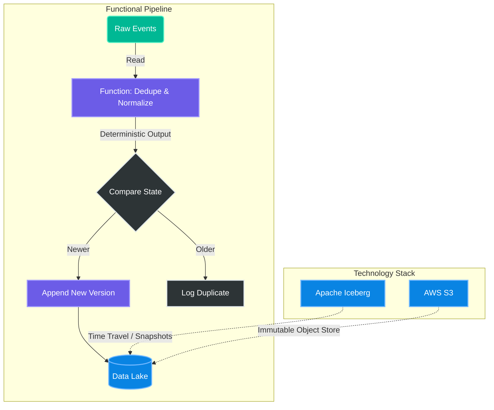

# Functional Data Engineering: The Discipline of Immutability

## 1. Concept Definition

**The Context**: In the "Old World" of Hadoop/Hive, partitions were physically immutable. To update data, you had to overwrite the entire folder. This enforced a crude but effective discipline.
**The "New World" (Iceberg/Delta)**: Modern table formats allow `UPDATE`, `DELETE`, and `MERGE` at the row level. This gives you a "scalpel" (precision edits) but also a "chainsaw" (destructive in-place mutation).

**Functional Data Engineering** is the practice of treating data pipelines as **pure functions**, even when the underlying storage is mutable.
*   **Pure Function**: $f(input) = output$. Running the same logic on the same input *always* yields the same result.
*   **Immutability**: You never "update" a fact; you append a new version of the truth. State is modeled explicitly (e.g., `is_current`, `valid_to`), not implicitly by overwriting rows.

## 2. Real-Time Example: The "WAP" Pattern

**Scenario**: You are processing a stream of financial transactions using Spark Structured Streaming. Occasionally, you get late-arriving corrections.

**The Anti-Pattern (The Chainsaw)**:
You simply `MERGE` the stream into your Silver table using `upsert`.
*   *Why it's bad*: It's non-deterministic. If you re-run the batch from yesterday, and the "current state" of the table has changed, your result changes. You lose history.

**The Functional Approach (The Scalpel)**:
Use the **Write-Audit-Publish (WAP)** pattern or **SCD Type 2**.
1.  **Write**: Write the new micro-batch to a "Staging" or "Quarantine" location (shadow write).
2.  **Audit**: Run data quality checks (functional tests) on this batch.
    *   *Check*: Does this batch violate any primary keys relative to the existing history?
3.  **Publish**:
    *   If **Pass**: Commit the transaction to the main table. If using SCD2, close out the old record (`valid_to = now()`) and append the new one.
    *   If **Fail**: Fail the batch safely without corrupting the main table.

## 3. Syntax Example (PySpark Functional Merge)

```python
from delta.tables import DeltaTable

def functional_upsert(microBatchDF, batchId):
    target = DeltaTable.forPath(spark, "/data/gold/transactions")
    
    # 1. Deduplicate INPUT (Make f(input) deterministic)
    deduped_batch = microBatchDF.dropDuplicates(["txn_id"])
    
    # 2. Idempotent Merge (Never blindly overwrite)
    (target.alias("t")
     .merge(
         deduped_batch.alias("s"),
         "t.txn_id = s.txn_id"
     )
     # Functional Logic: Only update if the new version is strictly newer
     .whenMatchedUpdate(
         condition="s.event_ts > t.event_ts",
         set={
             "amount": "s.amount",
             "event_ts": "s.event_ts", 
             "updated_at": "current_timestamp()" # Explicit side-effect tracking
         }
     )
     .whenNotMatchedInsertAll()
     .execute()
    )
```

## 4. Mermaid Visualization


