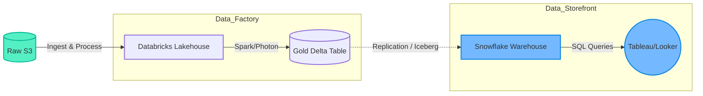

# Snowflake vs Databricks (2026 Perspective)

This note compares the two giants of the Data Platform world as of 2026. While they are converging (Snowflake adding Python/AI, Databricks adding SQL/Warehousing), their core DNAs remain distinct: **Databricks is the "Data Factory"** (Engineering/ML), and **Snowflake is the "Data Storefront"** (BI/Analytics).

## Key Trends in 2026
* **Databricks Lakeflow**: No-code ETL + improved Vector Search for RAG.
* **Snowflake Intelligence**: AI-driven assistant for business users (Text-to-SQL).
* **Hybrid Strategy**: The industry standard is becoming "Databricks for heavy lifting/ML" $\rightarrow$ "Snowflake for serving BI".

---

## 👷 Principal Engineer's Deep Dive

### 1. Concept Definition
**The Architecture Dichotomy**:
* **Databricks (Lakehouse)**: Open storage (Delta Lake) + Compute (Spark/Photon). Files are first-class citizens. Ideal for unstructured data, streaming, and heavy transform logic.
* **Snowflake (Modern Warehouse)**: Proprietary storage (Micro-partitions) + Compute (V-Warehouses). Tables are first-class citizens. Ideal for high-concurrency SQL reading and governed sharing.

### 2. Real-time Data Engineering Implementation
*"How do we implement the Hybrid Strategy?"*

**Scenario**: We need to ingest raw logs, clean them (Heavy Compute), run an ML model (Python), and serve the results to Tableau (High Concurrency SQL).

**Step A: The "Factory" (Databricks)**
Use **Delta Live Tables (DLT)** for the heavy lifting:
```python
import dlt

@dlt.table
def cleaned_logs():
 return (
 spark.readStream.format("cloudFiles")
 .option("cloudFiles.format", "json")
 .load("s3://raw-bucket/logs/")
 .filter("error_code IS NOT NULL")
 )
```

**Step B: The "Storefront" (Snowflake)**
Use **Snowpipe** or **Iceberg Integration** to serve it:
```sql
-- 2026 approach: Use Iceberg to avoid copying data
CREATE ICEBERG TABLE served_logs
 EXTERNAL_VOLUME = 's3_vol'
 CATALOG = 'SNOWFLAKE'
 BASE_LOCATION = 'processed/logs/'
 AS SELECT * FROM ...;
```

### 3. Visualization: The Hybrid Pattern



### 4. Flashcard
*(See Mart)*
