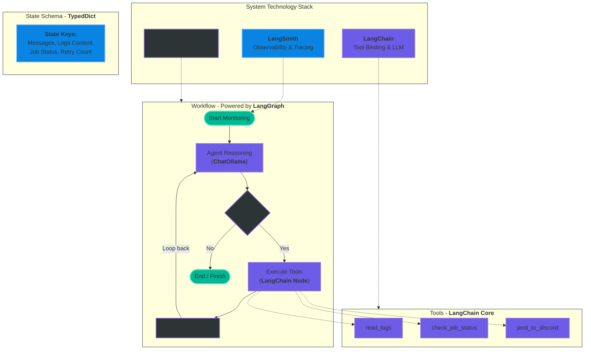

```mermaid
flowchart TD

    %% Global Graph Configuration

    %% --- Section 1: Technology Stack Reference ---

    subgraph Tech_Stack [System Technology Stack]

        Stack1[<b>LangGraph</b><br/>Cyclic Orchestration]:::logic

        Stack2[<b>LangSmith</b><br/>Observability & Tracing]:::storage

        Stack3[<b>LangChain</b><br/>Tool Binding & LLM]:::process

    end


    %% --- Section 2: Agent State (Memory) ---

    subgraph State_Schema [State Schema - <b>TypedDict</b>]

        StateItems["<b>State Keys:</b><br/>Messages, Logs Content,<br/>Job Status, Retry Count"]:::storage

    end


    %% --- Section 3: Cyclic Workflow ---

    subgraph Agent_Loop [Workflow - Powered by <b>LangGraph</b>]

        Start([Start Monitoring]):::user --> AgentNode["Agent Reasoning<br/>(<b>ChatOllama</b>)"]:::process

        AgentNode --> Router{"Tool Call?"}:::logic

        Router -- Yes --> ToolNode["Execute Tools<br/>(<b>LangChain Node</b>)"]:::process

        Router -- No --> EndNode([End / Finish]):::user

        ToolNode --> RetryNode[Increment Retry]:::logic

        RetryNode -- Loop back --> AgentNode

    end


    %% --- Section 4: Tools ---

    subgraph Tools_Layer [Tools - <b>LangChain Core</b>]

        T1[read_logs]:::process

        T2[check_job_status]:::process

        T3[post_to_discord]:::process

    end

    %% Visual Connections between Stack and Logic (Dash lines)

    Stack1 -.-> Agent_Loop

    Stack3 -.-> Tools_Layer

    Stack2 -.-> Start

    %% Connect Tools to Execution Node

    ToolNode -.-> T1

    ToolNode -.-> T2

    ToolNode -.-> T3

    %% Styling to match Subgraphs

    style Tech_Stack fill:,stroke:#2d3436,stroke-width:1px,color:#2d3436

    style State_Schema fill:,stroke:#2f3542,stroke-width:1px,color:#2d3436

    style Agent_Loop fill:,stroke:#2f3542,stroke-width:1px,color:#2d3436

    style Tools_Layer fill:,stroke:#2f3542,stroke-width:1px,color:#2d3436


    %% Global Style Block

    classDef logic fill:#2d3436,stroke:,stroke-width:2px,color:

    classDef storage fill:#0984e3,stroke:#74b9ff,stroke-width:2px,color:

    classDef process fill:#6c5ce7,stroke:,stroke-width:2px,color:

    classDef user fill:#00b894,stroke:#55efc4,stroke-width:2px,color:

    classDef group fill:,stroke:#2f3542,stroke-width:1px,color:#2d3436
```

