- Glue -> Fully managed cloud-optimized ETL service on AWS
  collapsed:: true
	- Glue crawler scans data in S3, creates schema Can run periodically Populates the Glue Data Catalog
	  collapsed:: true
		- Stores only table definition
		- Original data stays in S3
		- Once cataloged, you can treat your unstructured data like it's structured
			- Redshift Spectrum ,Athena ,EMR , Quicksight. Can also be imported in Hive catalog
		- Glue crawler will extract partitions based on how your S3 data is organized
			- 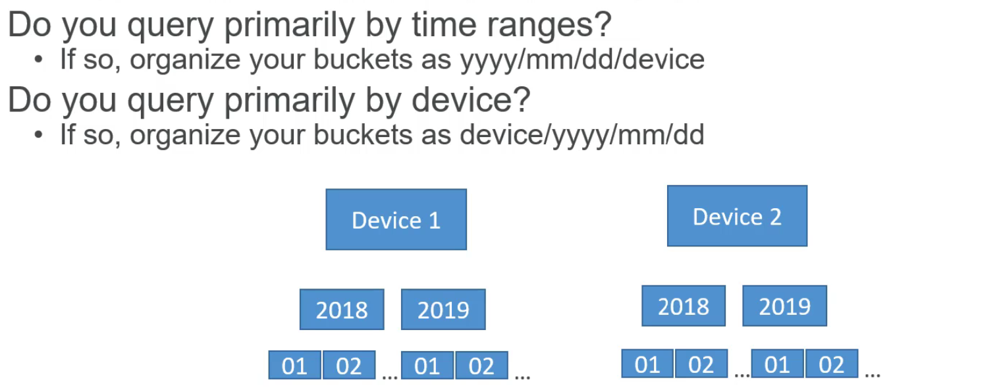
		-
- Glue architecture . how does it work ?
  collapsed:: true
	- 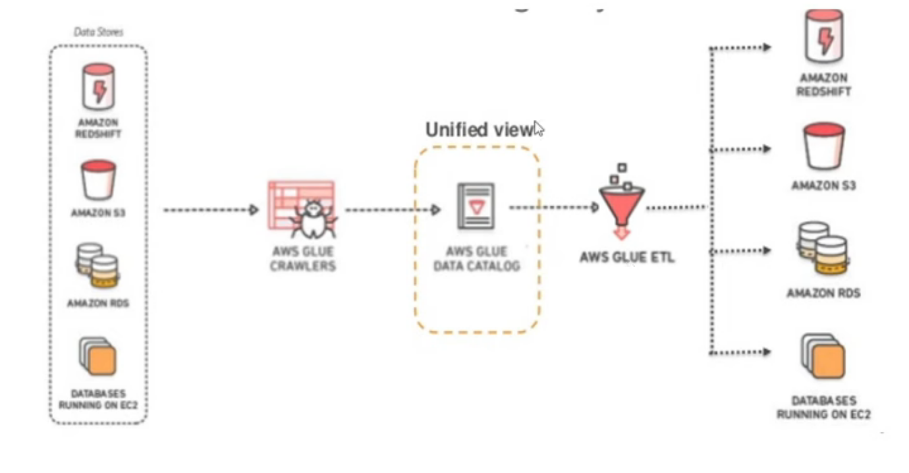
	- 1. Crawlers populate the Data Catalog with metadata from data sources
	  2. ETL jobs are created using the metadata in the Data Catalog
	  3. Jobs are scheduled or triggered to extract, transform, and load data
	  4. AWS Glue manages the underlying infrastructure for job execution
- Scheduling => On-demand: Manual trigger, Scheduled: Time-based recurring,  Conditional: Based on events/job completion, Event-driven: Based on S3 events, etc.
- File Formats (CSV, Parquet , Avro , ORC etc)
- Table Formats (Iceberg , Delta , Hudi etc)
- Classifier -> format of data sources ex: (JSON, CSV, web logs, databases) and allows custom classifiers
  collapsed:: true
	- Classifiers return a certainty number indicating confidence in format recognition
	- Users can create custom classifiers using grok patterns, XML tags, JSON, or CSV formats
	- Custom classifiers are invoked first, followed by built-in classifiers if needed
	- Crawlers use classifiers to define metadata tables in the AWS Glue Data Catalog
	-
- AWS Glue studio (Where Transformations are handled) -> pyspark , scala, etc . spark vs  Glue
  collapsed:: true
	- use **custom connector** to load into target from difference source .
	- **DQ** rules can be defined at to validate the source data
	  collapsed:: true
		- 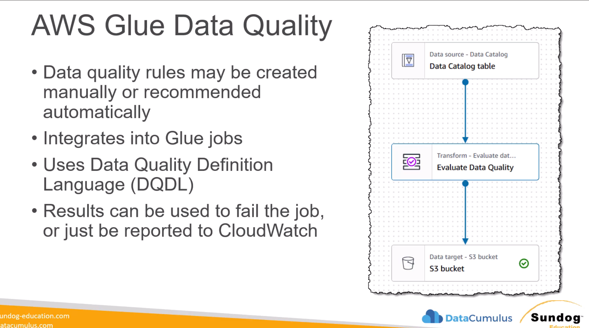
	- 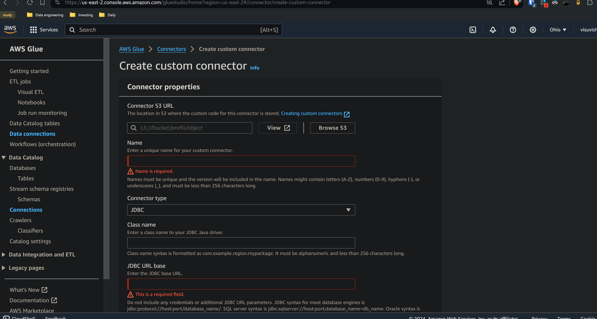
	- Dynamicframe ~ Dataframe
	- 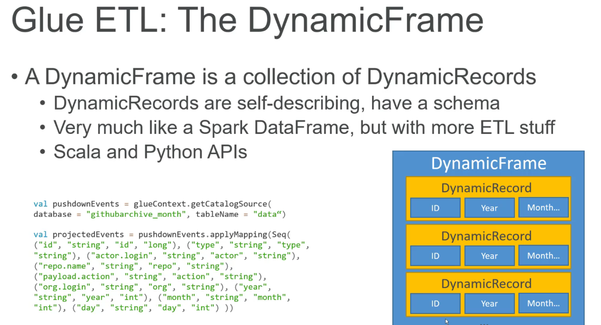
	- Transformations (Filter , Join , Map ,ResolveChoice etc)
		- 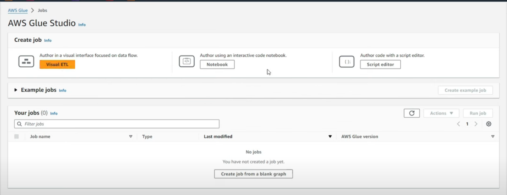
		- ResolveChoice => In  **ResolveChoice** transformation is used to handle ambiguous column
		- ```python
		  import sys
		  from awsglue.transforms import *
		  from awsglue.utils import getResolvedOptions
		  from pyspark.context import SparkContext
		  from awsglue.context import GlueContext
		  from awsglue.job import Job
		    
		  sc = SparkContext.getOrCreate()
		  glueContext = GlueContext(sc)
		  spark = glueContext.spark_session
		  job = Job(glueContext)
		  
		  dyf_customer= glueContext.create_dynamic_frame_from_options(connection_type= 's3',
		                                                                 connection_options={"paths": ['s3://s3-bucket/raw/customer/customer_order/']},
		                                                                 format='csv', format_options = {"withHeader": True, "optimizePerformance": True})
		  
		  ```
		- 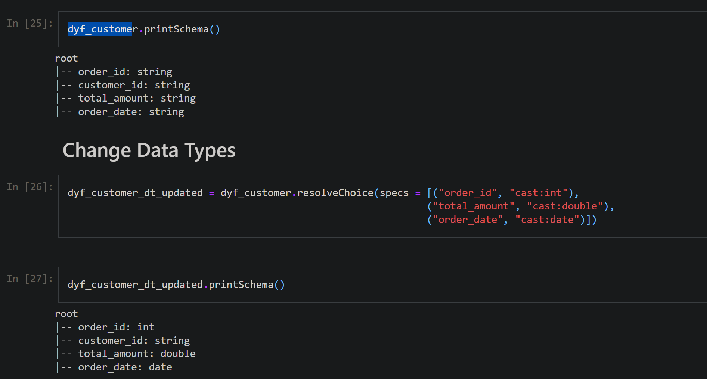
			- you can also use "make_cols" . resolved_dyf = dyf.resolveChoice(specs=[("value", "make_cols")])
			- This would create `value_long`, `value_string`, etc.
			-
	-
- ***Optimizations*** -> 1)Memory Optimizations 2) Capacity Optimizations
  collapsed:: true
	- Memory Optimizations
	  collapsed:: true
		- Pushdown Predicate (Filtering data closer to the source)
		  collapsed:: true
			- Pushdown Predicates work primarily with partitioning columns. For example, if data is
			  partitioned by year, month, and day, the predicate
			- Syntax with example 
			  ```python
			  glue_context.create_dynamic_frame.from_catalog(
			      database = "my_S3_data_set",
			      table_name = "catalog_data_table",
			      push_down_predicate = "year='2022' and month='06'"
			  )
			  ```
			- Example2 : In Cava , for most of the reports we are filtering data from 2018
		- Single query vs multi - parallel reads /Writes
			- single query
			- ```python
			  fooddf = glueContext.create_dynamic_frame. from_catalog(
			  database="dojodb",
			  table_name="fooddemand",
			  )
			  ```
			- multi - parallel reads /Writes
			  collapsed:: true
				- "from_catalog  / Additional_options " -> use hashfield, hashpartitions
				  collapsed:: true
					- ```python
					  fooddf = glueContext.create_dynamic_frame.from_catalog(
					  database="dojodb",
					  table_name="postgres_public_fooddemand",
					  additional_options = {
					  'hashfield': 'week',
					  'hashpartitions': '5'
					  }
					  )
					  ```
				- from_options (this is famous and widely used ) -> use hashfield, hashpartitions
				  collapsed:: true
					- ```python
					  create_dynamic_frame.from_options(Lonnection_type, connection_options={},
					  format=None, format_options={})
					  
					  connection_options = {"url": "jdbc-url/database", "user":
					  "username", "password": "password", "dbtable": "table-name",
					  "redshiftTmpDir": "s3-tempdir-path" , "hashfield": "month"}
					  ```
				- writes
				  collapsed:: true
					- single query (Directly hitting the source)
					  collapsed:: true
						- ```python
						  glueContext.write_dynamic_frame. from_options(
						  frame=df, connection_type="redshift/postgresq1/mysql",
						  corlaection_options = { "user" : uname,
						  "password" : pwd, "url" : "jdbc_url",
						  "dbtable" : "fooddemand",
						  "redshiftTmpDir": "s3_uri" })
						  ```
					- enable parallism (bulkSize)
					  collapsed:: true
						- glueContext.write_dynamic_frame.from_options(
						  frame=df, connection_type="redshift/postgresql/mysq1",
						  connection_options = { "user" : uname,
						  "password" : pwd, "url" : "jdbc_url",
						  "dbtable" : "fooddemand",
						  "redshiftTmpDir": "s3_uri",
						  "bulkSize" : "<number>" })
	- Capacity Optimizations
	  collapsed:: true
		- Glue Job Capacity Configuration (Worker Type) . Measured in DPU (Data Processing Unit)
		- ```markdown
		  G.025X: 0.25 DPU (2 vCPUs, 4 GB memory, 84 GB disk)
		  G.1X: 1 DPU (4 vCPUs, 16 GB memory, 94 GB disk)
		  G.2X: 2 DPU (8 vCPUs, 32 GB memory, 138 GB disk)
		  G.4X: 4 DPU (16 vCPUs, 64 GB memory, 256 GB disk)
		  G.8X: 8 DPU (32 vCPUs, 128 GB memory, 512 GB disk)
		  ```
	- Real time issues
		- Issue 1 => Error Due to high level of parallelism
		  collapsed:: true
			- Parallelism automatically enables grouping without any manual configuration when the number of input files exceeds 50,000.
			- Due to a high degree of papalism, the Spark driver may run out of memory when attempting to read a large number of files.
			- 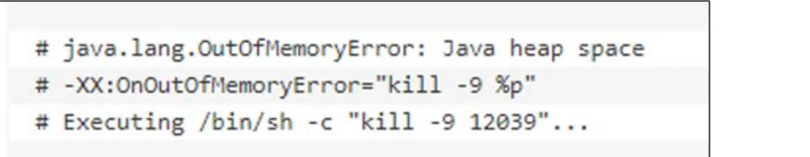
			- Solution =>control parallelism by grouping (groupFiles,groupSize)
			  collapsed:: true
				- ```python
				  dyf = glueContext.create_dynamic_frame_from_options
				  ("s3",
				  {'paths': ["s3://input-s3-path/"],
				  'recurse' : True,
				  'groupFiles': 'inPartition',
				  'groupSize': '1048576'},
				  format="json")
				  ```
				-
		- Issue2 =>No space left on device or "MetadataFetchFailedException"
		  collapsed:: true
			- Spark throws a No space left on device or "MetadataFetchFailedException" error when
			  there is not enough disk space left on the executor and there is no recovery.
			- Solution => spark shuffle manager. Let the spark to not use local disk and write to s3
			  instead .
			- 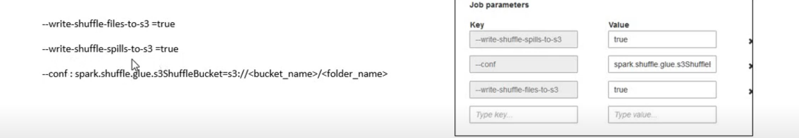
		- Issue 3 => Try to ingest large table instead of chucks
		  collapsed:: true
			- Solution => 1) Divide them into batches 2) Ingest only delta (Job Bookmark) 3) Run jobs multiple times using step functions
			- 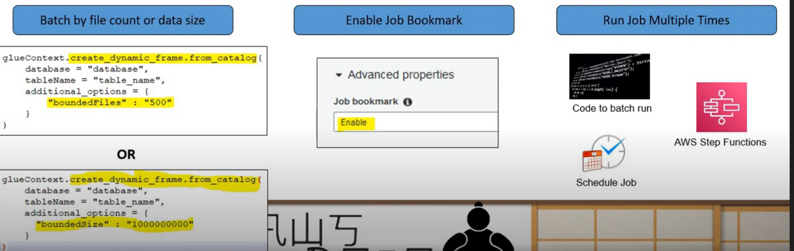
			- Using Job Bookmarks in AWS Glue Jobs
			  collapsed:: true
				- Job bookmark - persisted state information about the run
				- Multiple bookmark keys: You can specify multiple columns as bookmark keys for JDBC sources, forming a compound keys
				- reset a job bookmark in AWS Glue
					- aws glue reset-job-bookmark --job-name <job_name> --run-id <run_id>
					- Note : you can get run_id from job history
				-
		-
- Cost Optimizations ->
  collapsed:: true
	- Configure Tags as per projects
	- control the process of data
	- OptimizeData Formats Before Writing fileformats like parque , orc
	- use Flexible Execution class
	  collapsed:: true
		- 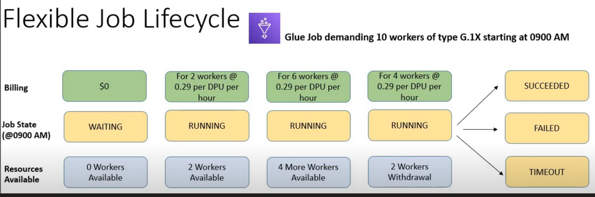
		- Working => you only pay for allocated resource ex: non-time-critical ETL Jobs like (Historical loads while team is working on something. This feature will not overload the resources)
		- Note : you can convert normal execution to flexible execution using AWS CLI
			- ```python
			  aws glue start-job-run
			  -- job-name dojo_standard_job
			  -- execution-class FLEX
			  -- timeout 120
			  ```
	- Pushdown Predicates
	- Enable Auto-Scaling for Glue Jobs
	- incremental instead of full load
	-
