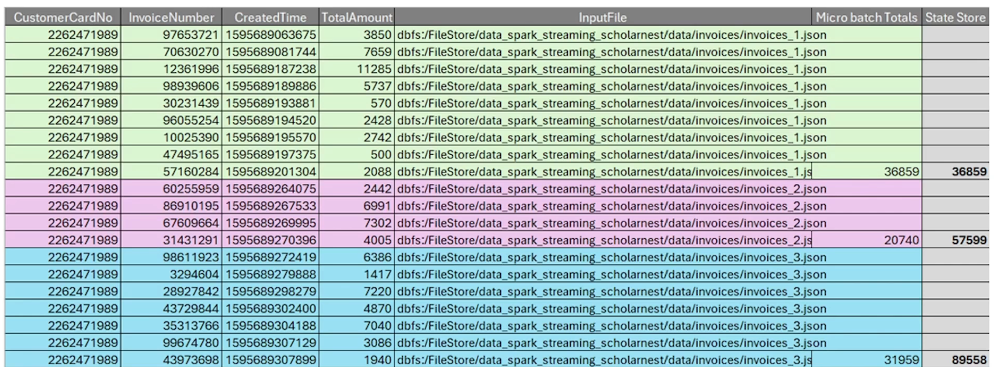

- Spark Structured Streaming processes data incrementally in micro-batches, not in one large batch like a traditional full load because it maintains intermediate state to avoid reprocessing all data in every micro-batch, unlike a full load that typically reads and processes all data from scratch. ^663e5ece-1a5a-427f-823d-f6d0bda70aa3
	- All the rows in the streaming "DataFrame/Dataset" will be written to the sink every time there are updates .
		- Use cases1 : It's typically used for scenarios where you need the complete aggregated results in each trigger, like generating reports or updating dashboards. It is mandatory for queries containing streaming aggregations like counts, sums, averages, etc .
		- Use cases2 : Ideal for materialized views or dashboards that require full refresh.
			- Ex: Count the number of customers for each window
	- Unbounded Continuous Aggregation
	- Syntax  => outputMode("complete") #typesofoutputModes 
	  
	  ```python
	  def saveResults(self, results_df):
	  print(f"\nStarting Silver Stream...", end=**)
	  return (results_df.writestream
	        queryName ("gold-update")
	        option("checkpointLocation", f"(self.base_data_dir)/chekpoint/customer _rewards")
	        outputMode("complete")
	        toTable(" customer_ rewards")
	  print ("Done")
	  ```
	  
	- Note : Be mindful that the `Complete` mode can be resource-intensive, especially with large datasets, as it stores the entire result in memory
- We want to implement incremental update . ^663dd827-1e19-41f2-92bf-588f97881619
-
