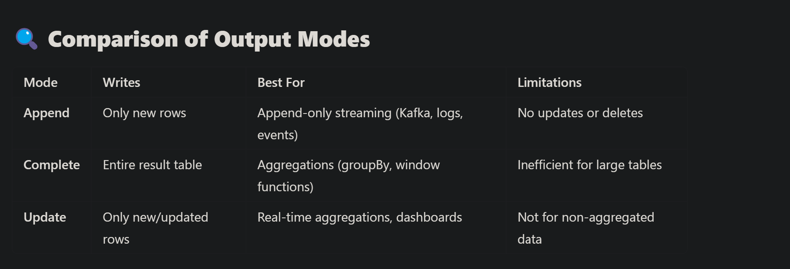
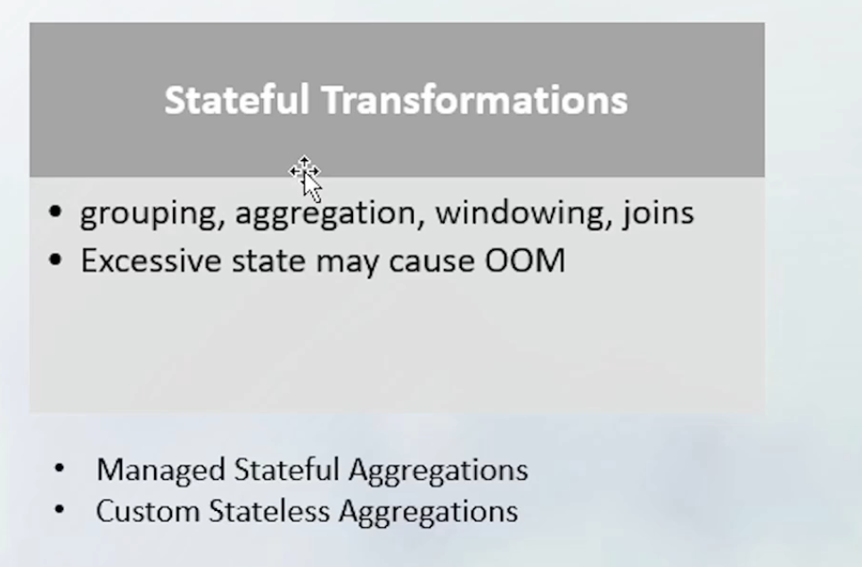

- Statefull  Transformation  -> spark is maintaining/storing  the results . pass the results across the micro batches.
- 
- [[OM:complete]]
- [[OM:update]] ^66426678-bb23-4917-8c31-cc691886f82b
  collapsed:: true
	- statefull aggregations
		- 
-
