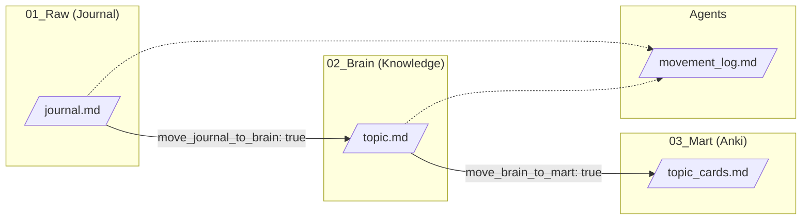

# Implementation Plan - Second Brain Automation V2

## Goal
Enhance the knowledge pipeline with:
1.  **Mirrored Structure**: `03_Mart` mirrors `02_Brain` taxonomy.
2.  **Frontmatter-Driven Automation**: Keys control file movement and card generation.
3.  **Strict Agent Rules**: Updated `GEMINI.md`.
4.  **Audit Logging**: Append-only `movement_log.md`.

---

## Workflow Diagram



---

## Proposed Changes

### 1. Update `GEMINI.md`
#### [MODIFY] [GEMINI.md](file:///c:/Misc/Dataengineering/Projects/build_second_brain/gemini/GEMINI.md)

**A. Replace Section 2 (Journal-to-Brain Workflow)**

**Remove this (Old Workflow):**
```markdown
3. **Draft (Staging)**: 
   - **If Existing File Found**: Prepare an **Append Entry**.
   - **If No Match**: Prepare a **New File**.
   - Save the draft to `./01_Raw/stage/<Topic>.md` for review.
4. **Review**: User checks the file in `stage`.
5. **Publish**: 
   - User says "Approve" or "Move to Brain".
   - Antigravity appends/moves content to the target file in `02_Brain`.
```

**Replace with (New Workflow):**
```markdown
3. **Process & Move (Direct)**:
   - If `move_journal_to_brain: true` -> Append/Create in `02_Brain/<Folder>/<Topic>.md`.
   - If `move_brain_to_mart: true` -> Generate cards in `03_Mart/<Folder>/<Topic>_cards.md`.
   - Delete source file from `01_Raw`.
   - Log action to `agents/movement_log.md`.
```

**B. Add New Section: "Rules for 03_Mart"**
- Mirror `02_Brain` folder structure.
- Define Anki card file naming: `<topic>_cards.md`.

**C. Add New Section: "Anki Card Syntax"**
```markdown
## Card Type: Basic
Q: What is the default trigger interval in Spark Streaming?
A: 0 (process as fast as possible).

---

## Card Type: Cloze
{{c1::Structured Streaming}} uses the {{c2::Catalyst Optimizer}}.
```

---

### 2. Frontmatter Schema
#### [MODIFY] [Journal.md](file:///c:/Misc/Dataengineering/Projects/build_second_brain/Templates/Journal.md)

| Key | Type | Default | Description |
| :--- | :--- | :--- | :--- |
| `created_at` | string | `{{date}} {{time}}` | Timestamp. |
| `status` | string | `seed` | Note maturity. |
| `processed` | bool | `false` | If `true`, Agent skips this file. |
| `tags` | string | (empty) | Determines target folder (e.g., `streaming`). |
| `examples` | int | `1` | Number of code examples to generate. |
| `Explain` | bool | `false` | If `true`, deep-dive analysis. |
| `move_journal_to_brain` | bool | `true` | Move note to `02_Brain`. |
| `move_brain_to_mart` | bool | `false` | Generate Anki cards in `03_Mart`. |
| `diagram_in_brain` | bool | `false` | Embed Mermaid in Brain note. |
| `diagram_in_mart` | bool | `false` | Embed simplified Mermaid in card. |

---

### 3. Create `03_Mart` Folder Structure
#### [NEW] Folders
Create these directories (matching `02_Brain/pages`):
- `03_Mart/01_Concepts`
- `03_Mart/02_Compute`
- `03_Mart/03_Streaming`
- `03_Mart/04_Cloud`
- `03_Mart/05_Warehousing`
- `03_Mart/06_Ingestion`
- `03_Mart/07_Languages`
- `03_Mart/08_Architecture`
- `03_Mart/09_AI`
- `03_Mart/99_Misc`

---

### 4. Logging
#### [NEW] `agents/movement_log.md`
- **Strategy**: Single append-only file.
- **Format**:
```markdown
| Date | Time | Source | Destination | Status |
| :--- | :--- | :--- | :--- | :--- |
```

---

## Edge Cases & Error Handling

| Scenario | Agent Behavior |
| :--- | :--- |
| `tags` is empty | Log warning, skip file. Do not move. |
| Target file already exists in Brain | **Append** to existing file (do not overwrite). |
| Target card file exists in Mart | **Append** new cards to existing file. |
| `processed: true` | Skip file entirely. |

---

## Verification Plan

1.  **Create Test File**: `01_Raw/test_automation.md`
    ```yaml
    ---
    tags: warehousing
    move_journal_to_brain: true
    move_brain_to_mart: true
    diagram_in_brain: true
    ---
    # Test Note
    Snowflake uses micro-partitions.
    ```
2.  **Trigger**: "Process my notes"
3.  **Verify**:
    - [ ] Content in `02_Brain/pages/05_Warehousing/test_automation.md`
    - [ ] Cards in `03_Mart/05_Warehousing/test_automation_cards.md`
    - [ ] `01_Raw/test_automation.md` deleted
    - [ ] Log entry in `agents/movement_log.md`
