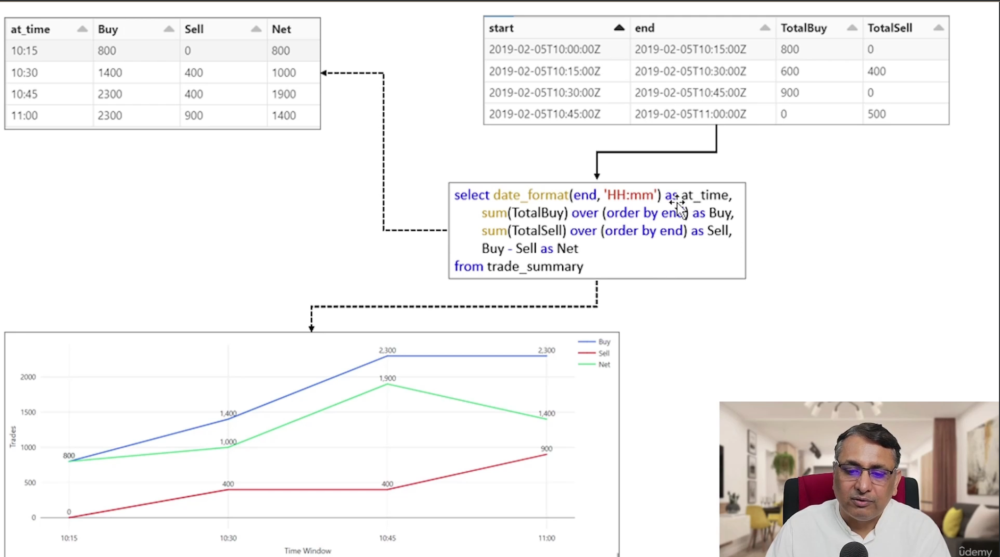
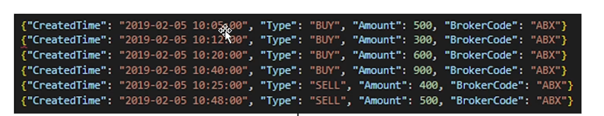
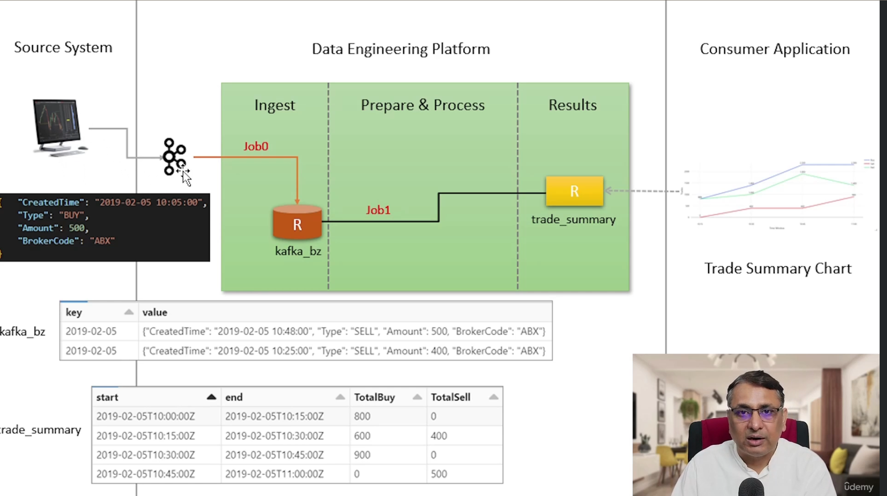
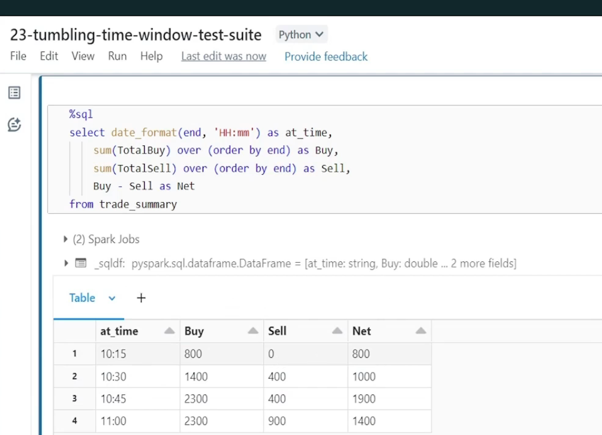
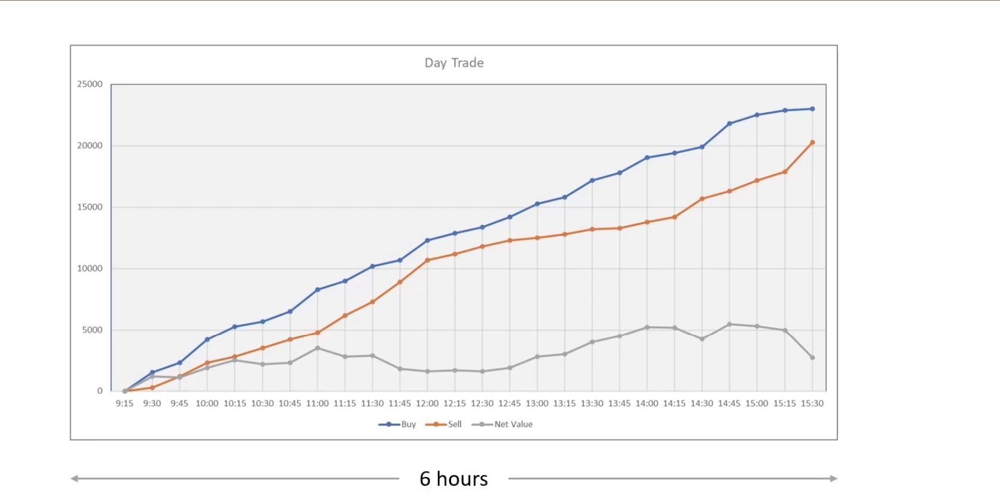
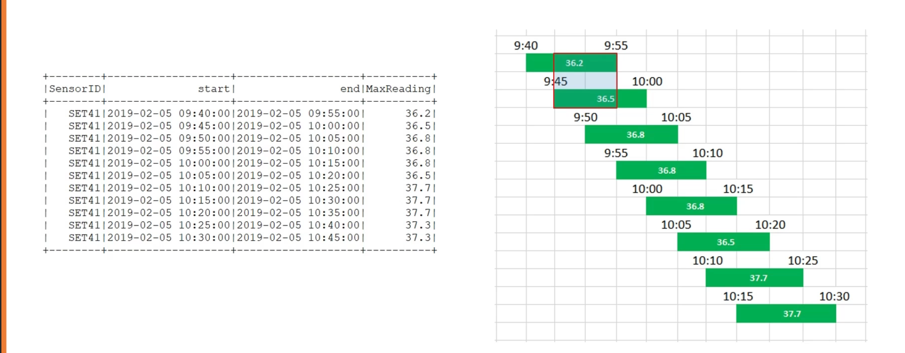
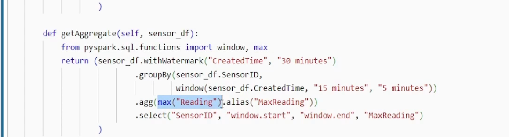
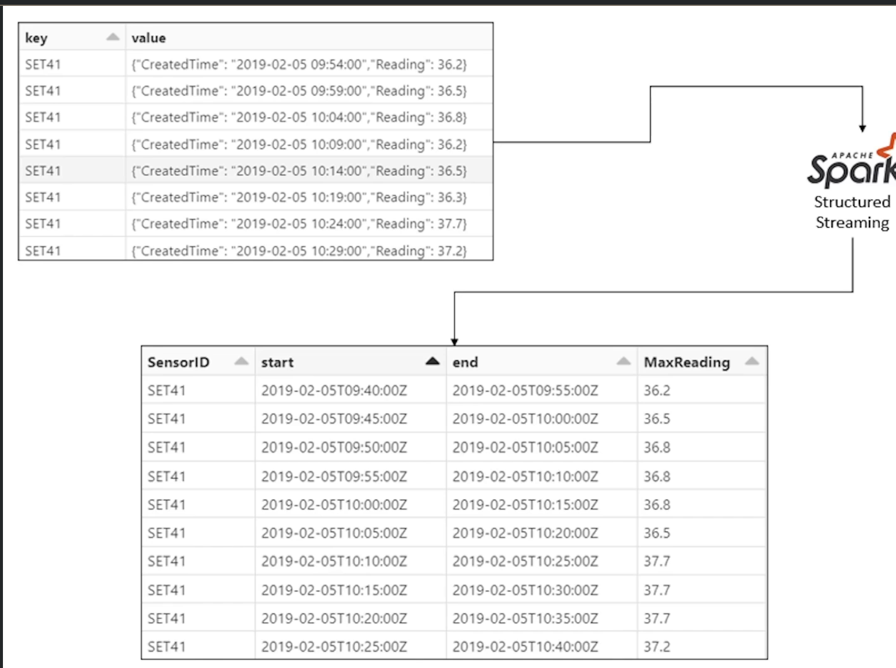

- Implement using **foreachBatch(self.upsert)**
  collapsed:: true
	- syntax => foreachBatch(self.<call back method>)
	  id:: 66427649-0d0a-4f6e-9cd4-9c8da1d7c627
		- Note : A callback function is a function that is passed as an argument to another function
		  
		  Need to use   .outputMode ("update").foreachBatch(self.upsert)
		  #+BEGIN_NOTE
		  upsert = merge + insert 
		  #+END_NOTE
		- ```python
		  def upsert(self, rewards_df, batch_id):
		  rewards_df.createorReplacetempview("customer_ rewards_df.
		  _temp_view")
		  
		  merge_statement = "''MERGE INTO customer_rewards t
		  USING customer_rewards_df
		  _temp_view s
		  ON s. CustomerCardNo == t. CustomerCardNo
		  WHEN MATCHED THEN
		  UPDATE SET t. TotalAmount = s. TotalAmount, t. TotalPoints = s. TotalPoints
		  WHEN NOT MATCHED THEN
		  INSERT *
		  rewards_af.jaf.sparkSession () - sql (merge_ statement)|
		  
		  
		  def saveResults(self, results_df):
		  print(f" (nstarting Silver Stream...", end="')
		  return (results_df writestream
		          .queryName ("gold-update")
		          .option ("checkpointLocation", f"(self.base_data_dir}/chekpoint/customer_rewards*)
		          .outputMode ("update")
		          .foreachBatch(self.upsert)
		          .start()
		  print ("Done")
		  ```
		-
- **Timebound Stateful Tumbling Window Aggregation**  #Tumblin_Win_Agg
  collapsed:: true
	- Time-bound aggregate / Late coming records
	- Window size could be microseconds, milliseconds, seconds, minutes, hours, and days
	- You need a timestamp column (event time) in your input records
	- Ex:aggregate sum function.
	- 
	- For input file =>
		- 
	- 
		- ```python
		  def getAggregate(self, trade_df):
		  from pyspark.sql.functions import window, sum
		        return (trade_df.groupBy (window(trade_df CreatedTime, "15 minutes"))
		        •agg(sum ("Buy").alias("TotalBuy"),
		        sum("Sell").alias("Totalsell"))
		        •select("window.start", "window.end", "TotalBuy", "Totalsell")
		                
		  def saveResults(self, results_df):
		  print(f"Instarting Silver Stream...", end=**)
		        return (results_df.writestream
		                •queryName ("trade-summary")
		        •option("checkpointLocation", f"(self.base _data_dir)/chekpoint/trade_summary")
		        •outputMode("complete")
		        •totable("trade_summary*i")
		  print ("Done")              
		                
		  def process(self):
		        kafka_df = self.readBronze()
		        trade_df = self. getTrade(kafka_df)
		        result_df = self. getAggregate(trade_df)
		         self.saveResults(result_df)  
		               
		  
		  ```
			- sample test data
				- 
				-
			- Test suit ==>
			   
- **Watermarking / State Store Cleanup / Late coming records handling** #Watermarking
  collapsed:: true
	- Spark streaming automatically handles the late coming records
	- Example
		- Assume we created windows every 15 mins. Here after 10.45 (assume 10.46) we got two records 
		  1) 10.48 2) 10.25 (Late record)
		- spark structure streaming can handle late record because the state store has information of previous window i.e 10.25 record belongs to 10:15 - 10.30 window.
		- so spark will fetch that previous record in state store and try to aggregate the late coming record .
		- 10.48 will be new window .
		- So as result "*Statestore size*" increases because of as this. so expire timeframe is required (1d,1w) . This is called "*Watermarking*".
		- ***watermark*** --> How long do you want to wait for a late record.
		- How to decide your watermark
			- What is the maximum possible delay? Discuss with business
			- When late records are not relevant? After watermark timeframe
			- 
		- syntax
			- collapsed:: true
			  ```python
			  
			  def getAggregate(self, trades_df) :
			  from pyspark.sql. functions import window, sum
			  return (
			          trades_df.withwatermark("CreatedTime","30 minutes")
			        •groupBy(window(trades_df.CreatedTime, "15 minutes"))
			        •agg(sum ("Buy").alias("TotalBuy"),
			        sum("sell").alias("Totalsell"))
			        •select("window.start", "window.end", "TotalBuy", "Totalsell"))
			  "))
			  
			  def saveResults(self, results_df):
			  print(f"Instarting Silver Stream...", end=**)
			        return (results_df.writestream
			                •queryName ("trade-summary")
			        •option("checkpointLocation", f"(self.base _data_dir)/chekpoint/trade_summary")
			        •outputMode("complete")
			        •totable("trade_summary*i")
			  print ("Done")
			                
			  def process(self):
			        kafka_df = self.readBronze()
			        trade_df = self. getTrade(kafka_df)
			        result_df = self. getAggregate(trade_df)
			         self.saveResults(result_df)                
			  ```
				-
- **Sliding Window Aggregates** #Sliding_Window
  collapsed:: true
	- *why we need Sliding Window?*
	  usecase : we need to get max_temp in 15 mins window but asked to inform the outcome every 5mins so we have an overlap here . so we have problem of overlapping
	- 
	- Implementation of sliding window and Tumbling window is similar where we pass 3rd parameter under window function
	- 
	- Test data :
	- 
-