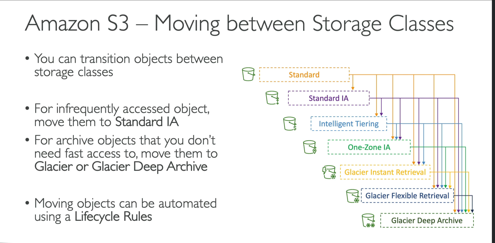
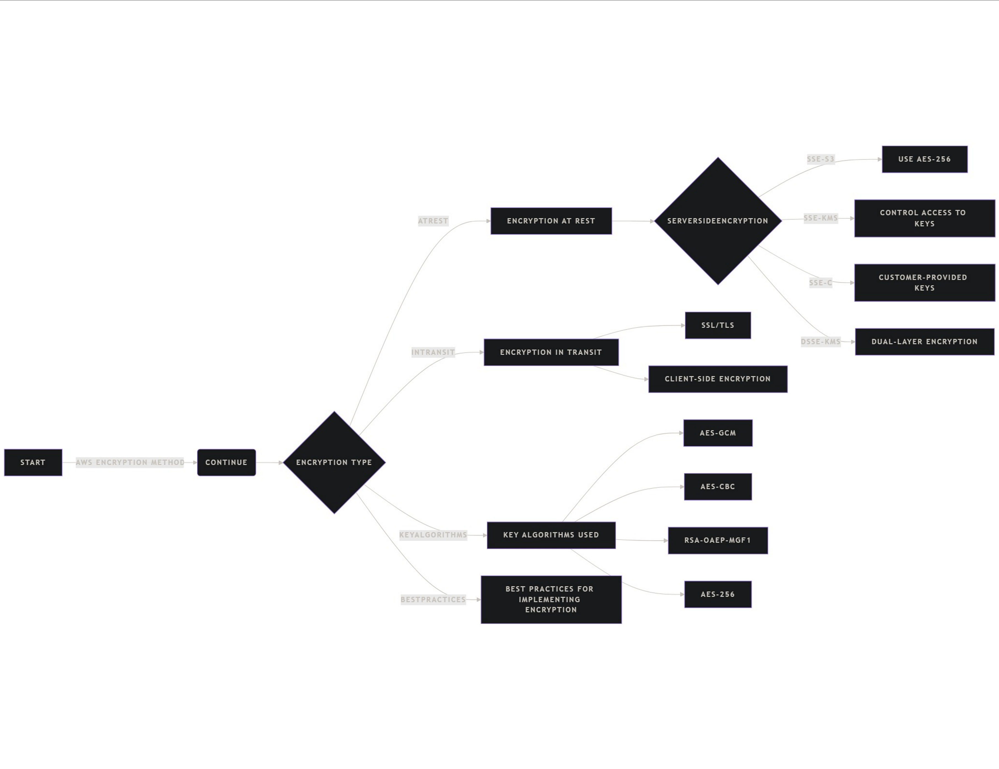

- S3
	- Storage classes
		- 
	- encryption
		- 
		- ## "Best Practices for Implementing Encryption"
		  1. "Understand Your Data": Assess sensitivity and compliance needs.
		  2. "Choose the Right Method":
			- Use SSE-S3 for simplicity.
			- Use SSE-KMS or DSSE-KMS for compliance and control.
			- Use SSE-C or client-side encryption for full control over keys.
			  3. "Enable Encryption by Default":
			- Configure S3 buckets to enforce encryption policies automatically.
			  4. "Audit Regularly": Monitor and verify encryption settings using tools like AWS CloudTrail or S3 Storage Lens.
			- **AES-GCM (Advanced Encryption Standard in Galois/Counter Mode)** with a 256-bit key length, often referred to as **AES-256**.This is widely used across AWS services for encrypting data at rest and in transit.
	-