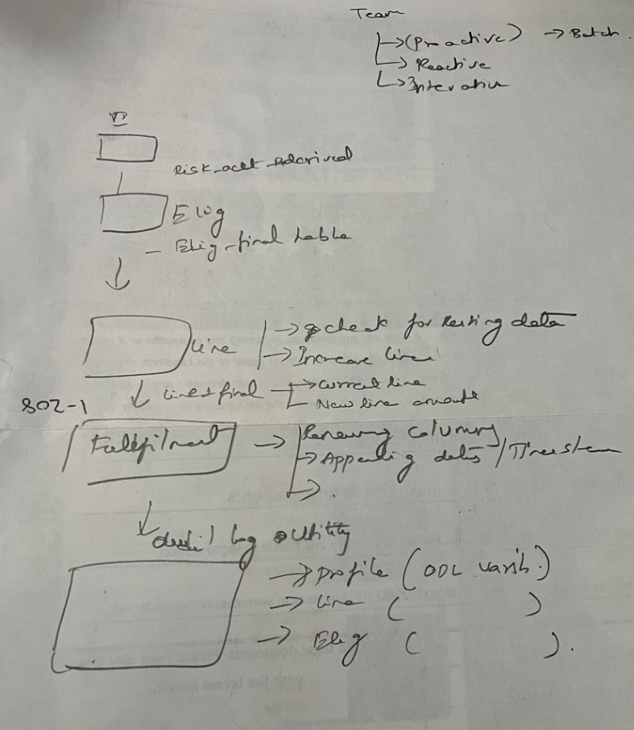

- parent:: [[Projects]]
- [[sqoop]]
- 
-
	- Fraud ODL
		- Project EDP => calculate the negativity variables as defined by business (we get mapping sheet ).
			- ex: negativity w.r.t Zipcode code . which we pull from customer 365 table . risk_cofficients will go higher if the particular zipcode has more defaulters. This is later consumed by New accounts team / proactive / reactive / integrative teams to increase / decrease there lines .
	- Proactive Team
		- We generate offers before to the customer and customer need to accept the offer with certain days
		- extract => Full the data from ODL ex : risk_account_derived
		- eligibility => Check his eligibility here . (If he filed for bankruptcy before . That is a flag which is calcaulted by risk team) .if the customer is eligible we calculate the line and increase / decrease the line for domestic / international offer
			- ex: During covid we revised / cancelled many offers
		- Line => Check for the resting- parent:: [[Projects]]
- ULAD (Mongo , Denormalized single document)==> Raw table ==> Raw+  (name: **loanevalutionrequest**,s3,parquet file ,  Document )  ==> BYOL job/aws statemachine/
ss logic provided by PO .
		- Fulfillments => Renaming the table names as per downstream add timestamps to the batch
		- Audit log utility => (Profile , line , eligiblity)
		-
		-
		-